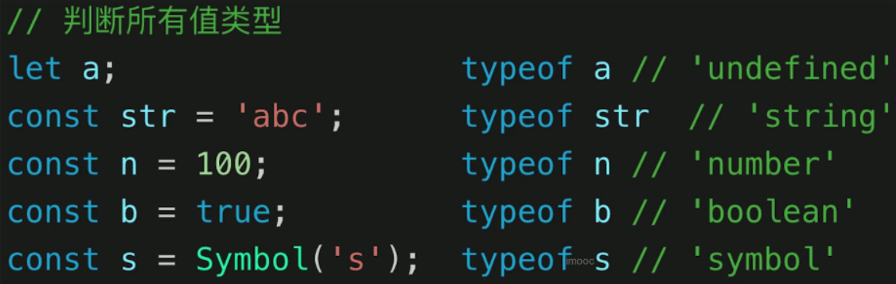

# JavaScript

## 1. JS类型

### （1）typeof 运算符




typeof最多只能判断到Object，比如array、null等都不能判断出来。

### （2） 判断Array或其他的Object（比如Null）

- 使用 **instanceof** 方法：

  ```js
  a instanceof Array   =>  true
  ```

- 使用**对象原型的toString**方法：

  ``` js
  Object.prototype.toString.call(null)   => [Object  Null]
  ```

- 使用查看构造函数的方法：

  ```js
  [].constructor  =>  Array()
  ```

- 如果是数组的话：ES5中定义了**Array.isArray**方法

### （3）Object的深拷贝

- **JSON方法**：先转成字符串，再转成对象。这种方法对undefine，function，symbol三种数据类型无效。只有可以转成**JSON**格式的对象才能这样做，像function，RegExp等不行。

  ```js
  let o2 = JSON.parse(JSON.stringfy(o1));
  ```

- **Object.assign 方法**：这个方法是ES6的新增方法，当对象只有一级属性，则为深拷贝，二级以后为浅拷贝。

  ```js
  Object.assign(target, source1, source2); // 同名属性前面的会被后面的覆盖
  ```

- **自己实现函数**：递归实现，要注意非Object的情况和数组的情况。

  ```js
  function deepClone(obj) {
      if (typeof obj !== 'object' || !obj)  // 判断obj是不是对象，或者为空
          return obj;
     	let result = obj instanceof Array ? [] : {};  // 判断是不是数组
      
      for (let key in obj) 
          if (obj.hasOwnProperty(key))  // 判断是不是自己的属性，不是原型的属性
              result[key] = deepClone(obj[key])  //递归
      
      return result;
  }
  ```

  

### （4）类型转换


- **==运算符**：尽量转换后再判断是不是相等


- **truely和falsely变量**


## 2. 原型和原型链

​	JS本身是基于原型继承的语言。ES6中的Class继承实质上也是使用原型的继承。

### （1） instanceof类型判断与原型


```js
class People {
    constructor(name) {
        this.name = name;
    }
    eat() {}
}

class Student extends People {
    constructor(name, number) {
        super(name);
        this.number = number;
    }
}

let xialuo = new Student('夏洛', 100);
```

​	**这两个类的原型关系如下：**


## 3. 作用域和闭包

### （1）作用域类别

- 全局作用域

- 函数作用域

- 块级作用域（ES6新增）

  **需要注意的点**

- **作用域链**：一个变量首先在当前作用域找，然后往上层作用域找，直到全局作用域。

- 自由变量的查找，是在**函数定义**的地方开始向上级作用域查找，而不是从函数调用的地方开始。

  ```js
  var x = 10;
  function fn() {
      console.log(x)
  }
  function show(f) {
      var x= 20;
      f();
  }
  show(fn);    // 输出10，因为fn函数定义的地方，找到的x是10
  ```

  ​		每个函数都有自己独立的执行环境，在代码完成的时候就确定了自己的作用域。卡住你的点就在于show函数的形参是一个函数，fn函数传进去的话好像变成了show函数的一个子函数了，其实不是的，你可以理解成就是请fn来帮忙，那fn还是以自己的风格来做事。虽然fn被show调用了，但还是在自己的执行环境里面行动的。

### （2） 变量提升，函数声明提升

- **什么是变量提升**

​		JS代码执行之前，浏览器会给一个全局作用域window。window分为两个模块，一个是存储模块，一个是执行模块。**存储模块**找到所有的 var 和 function 关键字给这些变量添加内存地址。**执行模块**是让代码从上往下执行，遇到变量之后回到存储模块去查找，有和没有就看是否赋值了。在使用的时候还没有赋值就是 undefined。

- **函数声明提升**，函数表达式会按变量处理。

  ```js
  console.log(fn);	// function(){}
  function fn() {};
  ```

  ```js
  console.log(fn);	// undefined
  var fn = function() {}
  ```

  ```js
  console.log(a);		// undefined
  var a = 3;
  ```

- **函数声明的优先级要高于var变量**

  ```js
  var f = function(a) {
      console.log(a);		// f a() {}
      var a = 2;
      function a() {}
      console.log(a);		// 2
  }
  f(1);
  ```

  ​	

### （3） this 的指向

​		this 在函数执行时才可以确定指向，它指向最终调用它的对象。


- 箭头函数的 **this** 永远是自己的上一级作用域的**this**；

- **call、apply、bind**实现更改this到指定对象。

- 普通函数调用的时候，**this**指向**window**

  

### （4） 手写一个bind函数

```js
Function.prototype.myBind = function() {
    // 将参数拆解为数组
    const args = Arrays.prototype.slice.call(arguments);
    const obj = args.shift();
    // 把obj作用域保存到self
    const self = this;
    // 返回一个函数
    return function() {
        return self.apply(obj, args);
    }
}
```

### （5） 闭包

- 什么是闭包：有权访问其他函数内部变量的函数，就是闭包。

  ​	**稍微全面一点的回答**：在JS中变量的作用域属于函数作用域，在函数执行完成后，作用域会被清理，内存也会随之被回收，但是由于闭包是建立在函数内部的子函数，可以访问上级作用域中的变量，即使上级函数执行完，作用域也不不会随之销毁，这时子函数（就是闭包），便拥有了上级作用域中变量的权限。

- 闭包解决了什么问题：
  - 可以读取函数内部变量，可以用来封装私有变量；
  - 可以模仿块级作用域；
  - 可以用来存储外部函数的变量，内部函数保存了外部函数活动变量的引用，导致他们不会被释放。


## 4. 异步和单线程

​		前端的异步任务主要用在两个地方：

- 网络请求与资源加载

- 定时任务或延迟任务

  **阶段**

- 在出现Promise之前，异步都是使用回调函数处理的，这样容易造成回调地狱（callback hell）。把一个函数A传给另一个函数B调用，则A就是回调函数。
- **Promise**：Promise解决了回调地狱的问题。实质上，它还是使用回调函数，但是，它把这些连续的回调函数改成了链式调用。

### （1） JS的异步是怎么理解的

​		JS是一个单线程的语言，这是由它的功能决定的。如何理解JS的异步任务：

​		在JavaScript中，所有任务可以分为两种，一种是同步任务，一种是异步任务。**同步任务**指的是，在主线程上排队执行的任务，只有前一个任务执行完毕，后一个任务才会执行；**异步任务**指的是不进入主线程、而进入任务队列的任务，只有当主线程上的所有同步任务执行完毕之后，主线程才会读取任务队列，开始执行异步任务。

### （2）手写Promise加载图片

```js
function loadImg(src) {
    return new Promise((resolve, reject) => {
        const img = document.createElement('img');
        img.onload = () => {
            resolve(img);
        };
        img.onerror = () => {
            const err = new Error(`图片加载失败 ${src}`);
            reject(err);
        }
        img.src = src;
    });
}

const url = 'https://..........';
loadImg(url).then(img => {
    return img;
}).catch(ex => console.log(ex));
```


## 5. JS 异步进阶

### （1） Event Loop 机制（事件循环/事件轮询）

- Event Loop是什么：JS是单线程运行的，异步需要基于回调来实现，event loop就是异步回调机制的实现原理。
- JS 如何执行：从前到后，一行一行执行，如果某一行报错，则停止下面代码的执行。**JS先把同步代码执行完，再来执行异步任务**。 
- **Event Loop** 机制运行过程： 
  - 如果是同步代码，则一行一行放入**调用栈（Call Stack）**执行，执行一行从调用栈删除一行；
  - 遇到了异步代码，会“记录”下来，等待时机（定时器是否到期、网络请求是否返回）；
  - 时机到了，将异步任务放入**回调队列（Callback Queue）**中；
  - 如果**调用栈（Call Stack）**为空（即，同步代码全部执行完毕），**Event Loop**就开始工作；
  - 轮询查找**回调队列（Callback Queue）**，如果有任务则移动到**调用栈（Call Stack）**执行并删除；
  - 继续轮询查找。
- DOM事件也使用Event Loop事件，准确来说，任何回调函数都是基于Event Loop机制来实现的。DOM事件不是异步的，当事件触发，回调函数会立刻放入**回调队列（Callback Queue）**中。

### （2） 宏任务（macroTask）和微任务（microTask）

- 宏任务：setTimeout，setInterval，Ajax，DOM事件

- 微任务：Promise，async/await

- 微任务执行的时机比宏任务要早。

  ​	   每次调用栈（Call Stack）清空，即每次同步任务执行完的时候，都是DOM重新渲染的机会，如果DOM结构有所变化则重新渲染。然后再去轮询回调队列。

- 宏任务：在DOM渲染之后才触发。

- 微任务：在DOM渲染之前触发。

  > 为什么？ 从Event Loop的角度解释：微任务是 ES6 语法规定的，而宏任务是由浏览器规定的。微任务是存放在 **微任务队列（micro task queue）**里的，而不是**回调队列（宏任务队列）**。

  在引入微任务和宏任务的概念之后，Event Loop 的运行机制如下图：

  

### （3） Promise的状态和转换

- 三种状态：**pending，resolved，rejected**，状态的变化是不可逆的。
- **then **和 **catch **改变状态：
  - **then**里面正常返回resolved状态（可触发后续then回调），里面有报错则返回rejected状态（可触发后续catch回调）
  - **catch**里面正常返回为resolved状态（可触发后续then回调），里面有报错则返回rejected状态（可触发后续catch回调）


### （4） async/await

​		无论是原始的Callback还是Promise，都是通过回调函数来完成异步操作的。而**async/await**用同步的语法来编写异步代码。

- 用法

  ```js
  async function() {
      ...
      await fn();		// fn是具有异步代码的函数
      ...
  }
  ```

- **async/await**和Promise的关系：

  ​	**async/await**是消灭异步回调的终究武器，但它和Promise并不互斥，反而两者是相辅相成的。

  - 执行 async 函数，返回的就是一个 Promise 对象；
  - await 就相当于 Promise 的 then；
  - try … catch 可以用来捕获异常，那么就可以代替 Promise  的 catch。


​		**下面这种情况会报错**，因为await相当于then，不能捕获异常。要想处理这种情况要使用try…catch，如上面那张图。


### （5） 异步的本质

- async/await是消灭异步回调的终极武器；
- 但是 JS 还是单线程的，还是得有异步，还是基于 **Event Loop；**
- async/await 只是一个语法糖。
- **await**后面的内容，都可以看作是 Callback 中的内容，即异步。

### （6） for … of 循环

​		for … of 常用于异步的循环。for… in 还有 forEach 都只能用于同步循环。

​		下面这段代码，forEach循环，会等待一秒输出三个数。for … of 循环是每隔一秒输出一个数。因为它是在前一次遍历有结果后再遍历下一个。

```js
  function muti(num) {
    return new Promise((resolve, reject) => {
      setTimeout(() => {
        resolve(num * num)
      }, 1000)
    })
  }

  let arr = [1, 2, 3];

  arr.forEach(async (i) => {
    const res = await muti(i)
    console.log(res)
  })

  (async function (){
    for (let i of arr) { 
      console.log(await muti(i));
    } 
  }())

```


#  JS—>Web API

> - JS的基础知识，规定了语法（ECMA 262标准）
> - JS Web API，是操作网页的API（W3C标准）
> - 前者是后者的基础，两者结合才能实际运用

## 1. DOM的本质

​	Document Object Model，DOM的本质是由HTML文件解析出的一棵树。


## 2. DOM结构

### （1） property和attribute

- DOM对象的property是通过JS对象的方式获取的。由于DOM对象是对象，它也可以像其他对象一样存储自定义的property。**自定义的property方法和属性只会在JS中显示，并不会影响到HTML**。另外，property名区分大小写。

  ```js
  document.body.className
  document.body.myData = { name: 'wzj' };
  document.body.sayHi = function() {
      alert('hello');
  }
  ```

  使用 for … in 可以遍历出所有的标准的property和自定义的property。

  ```js
  ducument.body.custom = 5;
  for (var key in document.body){
      ......
  }
  ```

- DOM节点提供了一些方法来访问HTML 的 attributes。它的值只能是**字符串**，并且操作它会在HTML中呈现出来。另外，属性名不区分大小写。

  ```js
  el.hasAttribute(name);
  el.getAttribute(name);
  el.setAttribute(name);
  el.removeAttribute(name);
  ```

- 两者都有可能造成DOM的重新渲染，使用时尽量使用property。

### （2） HTMLCollection和NodeList      

​		它们都是类数组对象，但不是数组。变成数组：

```js
Array.prototype.slice.call()
[].slice.call()
Array.from()
```

- **HTMLCollection **是以节点为元素的列表，可以凭借索引、节点名称、节点属性来对独立的节点进行访问。HTML DOM中的Collections是实时变动的，当原始文件变化，Collections也会随之发生变化。

- **NodeList** 是节点的列表，HTML元素是节点的一种，因此HTMLCollection是NodeList的子集。NodeList包含任意节点类型，文本节点、注释节点、属性节点等，可以用对象的nodeType属性来判断结点的类型。

- HTMLCollection比较早，因此早期的一些查询方法会获得它。

  getElementsByClassName，getElementsByTagName   =>  HTMLCollection

  childNodes，getElementsByName，querySelectorAll   =>  NodeList


## 3. DOM性能问题

> - DOM 操作非常 “ 昂贵 ”， 要避免频繁的DOM操作，否则会导致卡顿问题；
> - 尽量对 DOM 查询做缓存，查询一次以后保存下来，尽量避免多次查询；
> - 将频繁的操作转化为一次操作。

- 避免频繁查询DOM元素，做好缓存。

  ```js
  for (let i = 0; i < document.getElementsByTagName('p').length; i++) {
      // 每次循环都查，频繁的DOM查询
  }
  
  const pList = document.getElementsByTagName('p');
  for (let i = 0; i < pList.length; i ++) {
      // 缓存了DOM元素，只进行了一次查询
  }
  ```

- 将频繁的DOM操作改为一次性操作

  ```js
  const listNode = document.getElementById('list');
  // 创建一个文档片段
  const frag = document.createDocumentFragment();
  //执行插入
  for (let x = 0; x < 10; x ++) {
      const li = document.createElement('li');
      li.innerHTML = "List item: " + x;
    	frag.appendChild(li);
  }
  // 将片段插入到DOM树中
  listNode.appendChild(frag);
  ```

  


## 4. BOM操作

​		Browser Object Model

### （1） 如何识别浏览器的类型

​		**navigator.userAgent**

### （2） 如何拆解URL各个部分


### （3） 主要的BOM对象

- window
- Screen
- Location
- History
- Navigator


## 5. 事件

### （1） 实现一个通用的事件绑定函数

```js
function bindEvent(el, type, selector, fn) {
    if (fn == null) {
        fn = selector;
        selector = null;
    }
    el.addEventListener(type, event => {
        if (selector) {
            // 如果selector存在，那么就是代理绑定
            if (event.target.matches(selector))
                fn.call(event.target, event);
        } else {
            // selector不存在，那么是普通绑定
            fn.call(event.target, event);
        }
    })
}

var el = document.getElementById('aaa');
bindEvent(el, 'click', function(event) {
    event.preventDefault();
    alert('');
});
```

### （2） 事件代理（事件委托）

- 简介：不在事件的发生地（直接dom）上设置监听函数，而是在其父元素上设置监听函数，通过事件冒泡，父元素可以监听到子元素上事件的触发，通过判断事件发生元素DOM的类型，来做出不同的响应。
- 好处：比较适合动态元素的绑定，新添加的子元素也会被监听到到操作，也可以由事件触发机制。
  - 代码较为简洁
  - 减少了浏览器内存的占用
  - 但是不要滥用，因为它只是相对于对每个元素做事件监听来说较为简洁。

### （3） 无限下拉列表，如何监听每个元素的点击

- 事件代理；
- 用e.target获取触发元素；
- 用matches来判断是否是触发的元素。


## 6. AJAX

### （1） 手写一个简易的AJAX请求

```js
const xhr = new XMLHttpRequest();
xhr.open('GET', '/api/index.html', true);
xhr.onreadystateChange = function() {
    if (xhr.readyState === 4) {
        if (xhr.status === 200) {
            console.log(JSON.parse(xhr.responseText));
        }	else {
            console.log ('其他情况');
        }
    }
}
xhr.send();

// 使用Promise封装
function ajax(url) {
    const p = new Promise((resolve, reject) => {
        const xhr = new XMLHttpRequest();
        xhr.open('GET', url, true);
        xhr.onreadystateChange() {
            if (xhr.readyState === 4) {
                if (xhr.status === 200)
                    resolve(JSON.parse(xhr.responseText));
                else if (xhr.status === 404)
                    reject(new Error('404 Not Found'));
            }
        }
        xhr.send(null);
    });
    return p;
}
```

### （2） readyState


### （3） 跨域问题

- 同源策略：
  - 浏览器规定，在进行AJAX请求的时候，当前网页和server必须同源。这是浏览器的安全机制；
  - 同源是指协议，域名，端口三者全部一致。否则会导致跨域问题。

- 可跨域资源：图片、css、js可以无视跨域，这些资源通常可以放在CDN中，CDN一般是外域。

- 所有的跨域，都必须经过server端的允许和配合，未经server端允许就实现了跨域，就说明浏览器有漏洞，这是一个危险信号。

### （4） 实现跨域的常用方法

- **JSONP**：

  - 原理：首先<script>标签可以绕过跨域限制，其次服务器在收到请求后可以任意地动态拼接数据返回。所以，只要服务端愿意返回，<script>标签就可以获得跨域的数据。

  - 实现：

    ```html
    <script>
        window.fun = function(data) {
            console.log(data);		// 这里是获得的服务器返回的数据
        }
    </script>
    <script src='一个跨域的地址'></script>   <!--请求服务器，服务器返回一个js文件，其中包含了fun的调用即可实现跨域-->
    ```

    

- **CORS**：

  ​		Cross Origin Resource Sharing，跨域资源共享。纯服务器的操作，服务器端需要设置http header。

  

  - 浏览器直接发出CORS请求，在请求头添加**Origin**字段，用来说明这个请求来自于哪个源，服务器会根据这个值来决定是否统一跨域请求。
  - CORS默认不会发送cookie，如果需要发送cookie，则请求头中需要打开**withCredentials**属性，同时，服务器的响应头应该添加**Access-Control-Allow-Credentials**为true。

- 服务器中转跨域

  ​		在前后端分离的项目中可以借助服务器实现跨域，具体做法是：前端向本地服务器发送请求，本地服务器代替前端再向真实服务器接口发送请求进行服务器间通信，本地服务器其实充当个「中转站」的角色，再将响应的数据返回给前端。

- **nginx**反向代理实现跨域：

  ​		通过配置nginx，使得它在返回响应的时候自动给响应头添加CORS的跨域字段。

  ```ymal
  location / {  
      add_header Access-Control-Allow-Origin *;
      add_header Access-Control-Allow-Methods 'GET, POST, OPTIONS';
      add_header Access-Control-Allow-Headers 'DNT,X-Mx-ReqToken,Keep-Alive,User-Agent,X-Requested-With,If-Modified-Since,Cache-Control,Content-Type,Authorization';
  
      if ($request_method = 'OPTIONS') {
          return 204;
      }
  } 
  ```
  
  


### （5) 几个常用的ajax的工具

- JQuery

  ```js
      $(function(){
          //请求参数
          var list = {};
          //
          $.ajax({
              //请求方式
              type : "POST",
              //请求的媒体类型
              contentType: "application/json;charset=UTF-8",
              //请求地址
              url : "http://127.0.0.1/admin/list/",
              //数据，json字符串
              data : JSON.stringify(list),
              //请求成功
              success : function(result) {
                  console.log(result);
              },
              //请求失败，包含具体的错误信息
              error : function(e){
                  console.log(e.status);
                  console.log(e.responseText);
              }
          });
      });
  
  ```

- **fetch**

  ​		fetch是一种HTTP数据请求的方式，是XMLHttpRequest的一种替代方案。fetch不是ajax的进一步封装，而是原生js。Fetch函数就是原生js，没有使用XMLHttpRequest对象。它默认返回的就是一个Promise对象。

  ```js
  fetch(url).then(response => response.json())
    .then(data => console.log(data))
    .catch(e => console.log("Oops, error", e))
  ```

  - 注意：无论收到什么状态码（404，500等），**fetch**返回的Promise都不会标记为reject状态。只有当网络故障的时候，才标记为reject。
  - 默认情况不会发送或接受cookie，除非设置**credentials**选项。

- **axios**

  ​		它在浏览器使用的就是XMLHttpRequest对象，因此它是对**AJAX**的封装。

  ```js
  // 为给定 ID 的 user 创建请求
  axios.get('/user?ID=12345')
    .then(function (response) {
      console.log(response);
    })
    .catch(function (error) {
      console.log(error);
    });
  ```

  

## 7. Web的存储

### （1） cookie

> ​       在HTML5问世之前，只能用cookie来做本地存储。但是，它本身是为了和浏览器进行通讯的，只不过借用了它的存储功能。

- 缺点：
  - 存储大小4kb；
  - 每次http请求时都需要将它发送到服务端，增加了请求的数据量；
  - 只能通过document.cookie = '…' 来修改，api过于简陋。

### （2） localStorage和sessionStorage

> ​	 HTML5专门为存储而设计的，每个站点最多可以存储5M

- 相对于cookie的优点：
  - API简单，人性化， getItem，setItem；
  - 不会随着http请求发送出去，节省了网络资源。

- 它们两个的区别：
  - localStorage数据会永久存储，只要不删除（removeItem / clear），就永久存在；
  - sessionStorage数据只存在于当前会话，浏览器关闭则会清空。

### （3） 三者的区别

- 容量上：cookie只有4kb，另外两者有5M；
- API易用性：后两者API更加简洁和人性化；
- 占用网络资源方面：cookie会跟随http请求被发送出去，后两者不会；
- 存在时间：cookie有自己的过期时间，过期后自动消失。sessionStorage临时保存，关闭浏览器或结束当前会话后就会消失。localStorage只要不删除就会永久保存。


# HTTP

## 1. 常用的状态码

- 1xx：服务器已经收到请求
  - 100：Continue，要求继续发送请求，比如post请求会首先发送header，收到100后在发出body；
  - 101：Switching Protocols，服务器端根据客户端的要求切换协议，只能切换到高级别的协议。比如，websocket协议，http请求头中Upgrade：websocket，服务器会返回101；
- 2xx：请求成功
  - 200：OK，一般用于get和post请求；
  - 201：Create，请求成功并成功创建文件，通常用于put请求；
  - 202：Accept，已经接受请求但是处理未完成。

- 3xx：重定向
  - 300：Mutiple Choice，请求的资源有多种选择，返回一个资源列表供客户端选择；
  - 301：Moved Permanently，请求的资源被永久移动到新的URI，返回这个新的URI，之后的任何该请求都使用新的URI代替；
  - 302：Found，临时移动，与301类似，但是客户端之后应该继续使用原来的URI。
  - 304：Not Modified，所请求的资源未修改，服务器返回此状态码时，不会返回任何资源。客户端通常会缓存访问过的资源，通过提供一个头信息指出客户端希望只返回在指定日期之后修改的资源。
- 4xx：客户端错误
  - 400：Bad Request，客户端请求的语法错误，服务器无法理解；
  - 401：Unauthorized，请求要求用户的身份验证；
  - 403：Forbbiden， 服务器理解请求客户端的请求，但是拒绝执行此请求；
  - 404：Not Found，服务器无法根据客户端的请求找到资源（网页）。通过此代码，网站设计人员可设置"您所请求的资源无法找到"的个性页面；
  - 405：Method Not Allowed，客户端请求中的方法被禁止；
- 5xx：服务器端错误
  - 500：Internal Server Error，服务器内部错误，无法完成请求；
  - 502：Bad Gateway，作为网关或者代理工作的服务器尝试执行请求时，从远程服务器接收到了一个无效的响应。


## 2. HTTP请求方法

- 传统的methods一般就get和post，简单的网页就这两个操作。

  - **get**：获取服务器的数据
  - **post**：向服务器提交数据

- 现在的methods在原有的基础上做了扩展：

  - **get**：获取数据；

  - **post**：新建数据；

  - **patch/put**：更新数据/创建文件；

  - **delete**：删除数据；

  - **head**：类似于GET请求，只不过返回的响应中只有报头，没有内容；

  - **options**：客户端查看服务器的性能，以及查询服务器所支持的请求方式；

  - **trace**：回显服务器收到的请求，通常用于测试或诊断；

  - **connect**：HTTP/1.1协议中预留给能够将连接改为管道方式的代理服务器。

    > 什么是管道/管线技术（pipelining）：HTTP Pipelining其实是把多个HTTP请求放到一个TCP连接中一一发送，而在发送过程中不需要等待服务器对前一个请求的响应；只不过，客户端还是要按照发送请求的顺序来接收响应。


## 3. Restful API

> Representational State Transfer，通常译为表征性状态转移。

- 它是一种新的API设计方法（其实早已推广使用）；
- 传统的API设计，是把每个URL当作是一个功能；
- Restful 设计，是把每一个URL当作是一个唯一的资源标识，用method表示操作类型。


## 4. http常见的Headers

### （1） 常见的Request Headers

- Accept：表示浏览器可以接受的数据格式。比如  text/plain, text/html；
- Accept-Encoding：浏览器可以接收的压缩算法，比如gzip；
- Accept-Language：浏览器可以接收的语言，比如 zh-CN；
- Connection：表示是否需要持久连接。（HTTP 1.1默认进行持久连接）。比如 keep-alive；
- Cookie： HTTP请求发送时，会把保存在该请求域名下的所有cookie值一起发送给web服务器。比如 Cookie: $Version=1; Skin=new;
- User-Agent：用户的浏览器信息，甚至操作系统信息；
- Content-type：发送的数据格式。比如 application/json；

### （2） 常见的Response Headers

- Content-type：返回的数据格式。比如 text/html; charset=utf-8；
- Content-length：返回的数据大小，有多少字节；
- Content-Encoding：返回的数据使用的压缩算法。比如 gzip；
- Set-Cookie：用来设置客户端的cookie。比如 Set-Cookie: UserID=JohnDoe; Max-Age=3600; Version=1

### （3） 与缓存相关的Headers，查阅缓存章节


## 5. HTTP缓存

### （1） 缓存简介

- 什么是缓存：将一些没有必要多次请求的资源保存在本地，当下次请求的时候，先从本地取。

- 为什么要缓存：

  - 减少冗余的数据传输，节省网络带宽；
  - 不需要更多带宽就更快加载界面，提高了用户的使用体验；
  - 降低了对原始服务器的要求，服务器可以更快响应；
  - 缓存降低了距离的时延，因为从较远的地方加载页面会更慢一点。

- 哪些资源可以被缓存？

  ​	静态资源可以被缓存：js，css，img等。

### （2） 强制缓存


- **Cache-Control**：在Response Header，服务器可以添加该字段来控制客户端的强制缓存逻辑，如果没有这个字段，默认为通知浏览器不缓存。可能出现以下配置：
  - max-age：设置一个最长缓存时间，过了这个时间需要重新请求，单位是秒；
  - no-cache：可以在本地缓存，可以在代理服务器缓存，但是这个缓存要服务器验证才可以使用。如果服务器发现不需要重新发送会返回304；
  - no-store：彻底禁用缓存，所有的内容不会保存；
  - public：允许客户端和中间代理缓存；
  - private：仅允许客户端缓存，不允许中间代理服务器缓存。

- **Expires**：在Response Header中，控制缓存过期时间，现在已经被Cache-Control代替，二者同时存在时以Cache-Control为准。

### （3） 协商缓存（对比缓存）

> ​    强缓存就是给资源设置过期时间，客户端每次请求的时候都会查看是否过期。如果过期了，客户端会去请求服务器，这时候就可以设置协商缓存。协商缓存需要客户端和服务器两端的交互。

- 原理：
  - 协商缓存是服务器端的缓存策略；
  - 服务器判断客户端的资源是否和服务端的一样；
  - 如果是一样的返回304，否则返回200并传输最新的资源。


- 资源标识：在Response Header和Request Header中分别有两种资源标识。

  - **Last-Modified**：资源的最后修改时间，由服务端发给客户端。客户端下次请求的时候会在Request Header中添加 If-modified-Since 字段。然后服务端验证这个字段。精确到秒级。

    

  - **Etag**：用来标示URL对象是否改变。这样可以应用于客户端的缓存：服务器产生ETag，并在HTTP响应头中将其传送到客户端，服务器用它来判断页面是否被修改过，如果未修改返回304，无需传输整个对象。

    

- 二者的区别：

  - 会优先使用Etag；
  - Last-Modified只能精确到秒级
  - 如果资源被重复生成而内容不变，则使用Etag会更加准确。

### （4） 缓存流程


## 6. 页面刷新对缓存的影响

- 正常操作：输入url，页面跳转，前进，后退。强制缓存和协商缓存都有效；
- 手动刷新：F5，强制缓存失效，协商缓存有效；
- 强制刷新：ctrl + F5，缓存全部失效。


# 开发环境

## 1. 抓包

> ​		移动端h5网页，没有像chrome那样的调试工具，查看网络请求时，需要使用工具来抓包。Windows可以使用工具 Fiddler。

- 手机和电脑必须连接在一个局域网中；
- 将手机代理到电脑上；
- 手机访问网页，即可用电脑抓包。

## 2. webpack和babel

​		模块化打包工具和语法转换工具。

## 3. 常用Linux命令

> ​		线上机器一般都是Linux系统，测试机也需要保持一致。测试机或者线上机出了问题，本地又不能复现，需要去排查。

### （1） 部署前的准备

- mkdir创建文件夹

  ```bash
  mkdir -p test/inner_test/www		# 加上-p/--parent后，如果目录路径上有不存在的，直接创建该文件夹
  ```

- cp复制内容

  ```bash
  cp [options] <源文件> <目标目录>
  options:
  	-n/--no-clobber 不覆盖已存在目录
  	-i/--interactive  覆盖前询问
  	-r  递归复制
  	-f  强制复制，强制覆盖
  
  cp -r www/* output/www/		#把www文件夹下的所有文件复制到output/www中
  ```

- tar压缩或解压文件

  ```bash
  tar [选项] <打包文件名> <文件>
  options:
  	-z: 支持 gzip 解压文件
  	-c: 建立新的压缩文件
  	-v: 显示操作过程
  	-f: 指定压缩文件
  	-x: 从压缩的文件中提取文件
  # 压缩
  cd output
  tar -zcvf ../output.tar.gz *;
  # 解压
  tar -zxvf ../output.tar.gz;
  ```

### （2） 部署阶段

- scp远程加密复制，scp是secure copy的缩写，要递归复制就加入 -r；

  ```bash
  scp output.tar.gz verymuch@10.xx.xx.xx:~/;	#~指个人目录
  ```

- ssh登录远程服务器，将打包好的内容复制到远程服务器后，我们就需要登录远程服务器，解压文件，然后起服务了。

  ```bash
  ssh <user>@<host>
  ssh wzj@10.xx.xx.xx
  # ssh默认是22端口，如果想要修改端口，通过-p参数
  ssh -p <port> <user>@<host>
  ```

### （3） 启动nginx服务

​		进入nginx安装目录下的sbin目录下

- 启动，关闭，重启

  ```bash
  ./nginx -c /usr/local/nginx/nginx/conf/nginx.conf  # 后面那一串是自己准备的配置文件
  ./nginx -s stop
  ./nginx -s reload
  ```

### （4） 排查阶段

- ping确认与目标机的连通性

  ```bash
  ping www.baidu.com
  ```

- telnet确认服务的端口是否可用

  ```bash
  telnet www.baidu.com 80
  ```

- 如果端口不可用，netstat显示与IP\TCP\UDP\ICMP协议相关的统计数据

  ```bash
  netstat -apn	# 查看所有端口的情况
  netstat -apn | grep 8380	# 查看指定端口的使用情况
  
  所有到的三个参数分别含义如下：
  -a/-all: 显示所有连线中的 Socket
  -n/–numeric: 直接使用 IP 地址，而不通过域名服务器
  -p/–programs: 显示正在使用 Socket 的程序识别码和程序名称。这个很有用，显示出当前端口的进程，可以便于我们kill掉。
  ```

- ps查看进程的状态

  ```bash
  ps aux | grep node.js
  ```


## 4. Git

​		**常用Git命令**

- git add .
- git checkout xxx
- git commit -m 'xxx'
- git push origin master
- git pull origin master
- git branch
- git checkout -b 'xxx'
- git merge
- git status
- git diff 'xxx'
- git fetch
- git stash
- git stash pop


 

# 运行环境

> - 前端页面的和运行环境即浏览器，包括微信小程序等也是内嵌入了一个web浏览器（服务端有node.js）；
> - 需要不断地下载网页代码，渲染出页面，期间还要执行若干的js代码；
> - 必须要保证代码在浏览器中稳定且高效。

## 1. 输入URL到页面渲染

- DNS解析：把域名转化为IP地址；
- 根据IP地址向对应服务器发起http请求；
- 服务器处理http请求，将资源返回给浏览器；（HTML,CSS,JS…）
- 根据html代码，浏览器生成一颗DOM树；
- 根据CSS代码，浏览器生成一颗CSSOM；
- 将DOM树和CSSOM整合，形成一颗Render树；
- 根据Render树渲染页面，如果遇到<script>则暂停渲染，优先加载并执行JS代码，完成后再继续（因为渲染和执行JS共用一个线程）；
- 直到完成Render树的渲染。

### （1） 将CSS的引入或编写放在\<head>

 		如果将CSS放在下面，在解析DOM树的时候，对应元素找不到CSS，会首先默认渲染，等到有CSS后再重新渲染一遍，这样会影响用户的感官，也降低了浏览器的效率。

### （2） JS应该放在body靠后的位置

​		浏览器在遇到<script>会停止DOM的解析，这可能会导致页面加载的卡顿。其次，JS代码可能会更改DOM的元素，应该等到DOM元素加载完成后再用JS处理。

### （3） onload 和 DOMContentLoaded事件


## 2. 性能优化

> **大体原则**：
>
> - 多使用内存，缓存或其他方法，减少HTTP请求；
> - 减少CPU的计算量，减少网络加载耗时；
> - 空间换时间（适用于所有编程的性能优化）。

**如何入手**

- 让加载更快
- 让渲染更快

### （1） 让加载更快

- 减少资源体积，压缩代码。服务端可以压缩文件等资源，比如gzip算法；
- 减少访问次数：合并代码，合并资源（雪碧图等），缓存资源；
- 使用更快的网络：使用CDN网络；
- 使用SSR服务端渲染：将网页和数据一起加载，一起渲染后传给前端显示。

### （2） 让渲染更快，更流畅

- CSS尽量放在<head>，JS尽量放在<body>靠下的地方；
- 尽早开始执行JS，用DOMContentLoaded触发JS代码执行而不是onload；
- 懒加载（图片懒加载、上滑加载更多 …）;

- 对DOM查询进行缓存，频繁的DOM操作应该合并，一起插入到DOM结构中；
- 节流throttle和防抖debounce。

### （3） 举例

- **文件缓存机制**：像webpack打包的时候，会在生成的文件名增加[content-hash]后缀。

  

  

- **使用CDN网络**：很多静态资源使用CDN速度很快。

  

- **SSR (Server Side Renderring)** 服务端渲染


- **懒加载**

  

  ​		首先将图片显示一个小预览图，把真正图片的url放在data-realscr中，等到需要加载的时候，将这个url赋值给图片的src，这时候会去下载图片。

- **缓存DOM查询，减少DOM操作次数**

  

  

- **尽早开始JS的执行**

  


### （4） 防抖debounce和节流throttle

- 手写debounce

  ```js
  // 简单的防抖函数
  let debounce = function(fun, wait) {
      // 定时器变量
      var timeout = null;
      return function() {
          clearTimeout(timeout);
          timeout = setTimeout(func, wait);
      }
  }
  
  // 稍微全面一点的防抖函数
  function debounce(fn, delay = 500) {
      // timer是闭包中的
      let timer = null;
      return function() {
          if (timer) {
              clearTimeout(timer);
          }
          timer = setTimeout(() => {
              fn.apply(this, arguments);
              timer = null;
          }, delay);
      }
  }
  
  window.addEventListener('resize', debounce(func, 500));
  ```

- 手写throttle

  ```js
  // 一个简单的节流函数
  let throttle = function(func, wait) {
      var timer = null;
      rerurn function() {
          if (timer)	return;
          timer = setTimeout(() => {
           	func.apply(this, arguments);
              timer = null;
          }, wait);
      }
  }
  
  window.addEventListener('resize', throttle(func, 100));
  ```


### （5） Web安全问题

- 常见的Web前端攻击：XSS跨站脚本攻击、CSRF跨站请求伪造攻击。

- **XSS攻击**，Cross Site Scripting：攻击者在在目标网站中嵌入脚本，用来获取cookie等。

  ​	预防策略：

  - 前、后端把<、>分别替换为 &lt 和 &gt；
  - 在HTTP响应头中设置Cookie: http-only，不允许js读取cookie。

- **CSRF（XSRF）攻击**，Cross-site Request Forgery：攻击者身份，以正当名义发送恶意请求，对服务器来说这个请求是完全合法的，但是却完成了攻击者所期望的一个操作，比如以你的名义发送邮件、发消息，盗取你的账号，添加系统管理员，甚至于购买商品、虚拟货币转账等。

  ​	预防策略：

  - 使用post接口，因为post接口跨域需要后台的支持；
  - 增加验证，例如验证码、短信验证、指纹、密码等等；
  - 验证HTTP请求的 Referer 字段，这个字段记录了HTTP请求的来源地址；
  - 在请求中添加token验证，或者在HTTP请求头中添加自定义的属性进行验证。