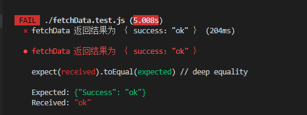

# Jest测试框架

> ​	主流测试框架： Jasmine、MOCHA、Jest

## Jest的优点

- 比较新：比 Jasmine、MOCHA要新；
- 基础好：性能好、功能多、应用简单；
- 速度快：具有单模块测试的功能，不用每次都重复测试；
- API简单：API简单、数量少；
- 隔离性好：测试环境相互隔离，避免了不同测试文件之间互相影响造成的错误；
- IDE的整合：vscode、idea；
- 多项目运行：多项目之前并行测试；
- 导出覆盖率：一条命令就能导出测试的覆盖率。

## Jest匹配器

```js
test('test name', () => {
    expect(fun(params)).[匹配器器方法]();
})
```

- toBe匹配器，相当于 ===；

- toEqual匹配器，测试对象的内容是否相等，不比较对象的地址，只关心对象的内容是否一致，会递归检查对象或者数组的每个字段；

- toBeNull匹配器，测试是否为null，是则passed，否则failed；

- toBeUndefined匹配器和toBeDefined匹配器；

- toBeTruthy匹配器和toBeFalsy匹配器，匹配true和false；

- 数字相关的匹配器：

  - toBeGreaterThan

  - toBeLessThan

  - toBeGreaterThanOrEqual

  - toBeLessThanOrEqual

  - toBeCloseTo

    ```js
    expect(0.1 + 0.2).toEqual(0.3);  // 结果是failed
    expect(0.1 + 0.2).toBeCloseTo(0.7);   // passed
    ```

- toMatch匹配器：

  ```js
  const str = 'www.baidu.com';
  expect(str).toMatch('baidu');   // passed, 表示str字符串中是否包含baidu这个字符串，是返回passed
  expect(str).toMatch(/baidu/); //passed，这里还可以写正则表达式
  ```

- toContain，数组包含匹配；

- toThrow匹配器，抛出异常匹配器；

- not匹配器，取反匹配器；

- ……  文档 https://jestjs.io/docs/expect

## Jest支持的模块化

> ​	Jest只支持CommonJs的模块化规范，不支持ESmodule的规范。

​	为了支持`ESModule`，需要用到babel。需要将`@babel/core`和`@babel/preset-env`安装到开发环境，并写配置文件`.babelrc`。

```bash
npm i @babel/core@7.4.5 @babel/preset-env@7.4.5 -D
```

```json
{
  "presets": [
    [
      "@babel/preset-env", {
        "targets": {
          "node": "current"
        }
      }
    ]
  ]
}
```

## Jest操作异步代码

- 异步回调函数的测试方法

  ```js
  export const fetchData = (fn) => {
      axios.get('https://rapi.qingting.fm/recommendations/0/channel_list?more=true&replay=false')
      .then((response) =>{
          fn(response.data.Success)
      });
  }
  ```

  ​		在fetchData.test.js写测试用例，在fetchData中的fn为具体的测试方法，在test中设置done();函数，调用于fetchData的回调函数中，当done();执行完毕，才能证明测试用例有真正的执行。

  ```js
  test('fetchData 返回结果为 ｛ success："ok" ｝', (done) =>{
      fetchData((data) => {
          expect(data).toEqual({
              Success: "ok"
          });
          done();
      });
  });
  ```

  

- Promise对象的异步函数的测试方法

  ```js
  //正常状态请求
  export const fetchData = () => {
      return axios.get('https://rapi.qingting.fm/recommendations/0/channel_list?more=true&replay=false');
  }
  //异常状态请求
  export const fetchData = () => {
      return axios.get('https://rapi.qingting.fm/recommendation1s/001/channel_list?more=true&replay=false');
  }
  ```

  - 运用promise的链式调用then，注意要写return，不然会有问题。

  ```js
  test('fetchData 返回结果为 ｛ success："ok" ｝', () =>{
      return fetchData().then((response) => {
          expect(response.data.Success).toEqual({
              Success: "ok"
          })
      });
  });
  ```

  - resolve和reject方法

  ```js
  test('fetchData 返回结果为 ｛ success："ok" ｝', () =>{
      //expect(fetchData()).resolves拿到的是返回的所有请求结果
      return expect(fetchData()).resolves.toMatchObject({
          data: {
              Success:"ok"
          }
      });
  });
  ```

  - async  await

  ```js
  test('fetchData 返回结果为 ｛ success："ok" ｝', async() =>{
      await expect(fetchData()).resolves.toMatchObject({
          data: {
              Success:"ok"
          }
      });
  });
  
  test('fetchData 返回结果为 ｛ success："ok" ｝', async() =>{
      const response = await fetchData();
      expect(response.data).toEqual({
          Success:"ok"
      })
  });
  ```

- 对于异常状态下的测试

  - promise链式调用catch捕获异常信息：

    ​        当返回的结果为404的时候，必须执行一次expect，expect.assertions(1);满足条件才算测试完成，.assertions(n)添加预期必须通过的expect个数。

  ```js
  test('fetchData 返回结果为 404', () =>{
      expect.assertions(1);
      return fetchData().catch((e) => {
          console.log(e.toString());
          expect(e.toString().indexOf('404')> -1).toBe(true);
      });
  });
  ```

  - 调用Promise的两个参数：resolve，reject，分别代表这个Promise实例成功之后的回调函数和失败之后的回调函数

  ```js
  test('fetchData 返回结果为 404', () =>{
      return expect(fetchData()).rejects.toThrow();
  });
  ```

  - 结合async/await 和try{}catch(){}捕获异常信息

  ```js
  test('fetchData 返回结果为 404', async() =>{
      expect.assertions(1);
      try {
          await fetchData();
      } catch(e) {
          expect(e.toString()).toEqual('Error: Request failed with status code 404');
          console.log(e.toString());
      }
  });
  ```

## 钩子函数

​		https://jestjs.io/docs/api#beforeallfn-timeout   官网

- beforeAll

- afterAll
- beforeEach
- afterEach

```js
beforeAll(() => {
	console.log('钩子函数')
})
```

## 分组测试

describe


# Vue Test Utils

