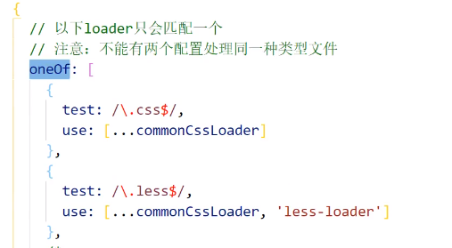

# Webpack

## 1. 简介

### （1） 是什么

> ​		它是一种前端资源构造工具，一个静态模块打包器（module bundler），在webpack看来，前端的所有资源文件（js、css、json、img、less….）都会作为，模块处理，它根据模块之间的依赖关系进行静态分析，打包生成相对应的静态资源（bundle）。

### （2） 五个核心概念

- Entry：表示Webpack从哪个文件为入口起点开始打包，分析构建内部依赖图；
- Output：输出表示Webpack打包后的资源bundle输出到哪里去，以及如何命名；
- Loader：让Webpack能够去处理那些非javascript文件，相当于翻译官，因为Webpack本身只理解Javascript；
- Plugins：插件可以用于执行范围更广的业务。插件的范围包括，从打包优化和压缩，一直到重新定义环境中的变量等；
- Mode：分为 development 开发模式和 production 生产模式。前者支持开发阶段的本地调试环境，后者支持线上运行阶段的生产环境。因此后者的要求高一些，而且后者还会压缩JS代码。

###  （3） 打包命令

- 本地开发环境
- 线上生产环境

```bash
webpack ./src/index.js -o ./build/built.js --mode=development
webpack ./src/index.js -o ./build/built.js --mode=production
```

​		webpack本身只能打包 js 文件和 json 文件，其他文件要使用loader。


## 2. 配置

> webpack的配置文件通常命名为： webpack.config.js     
>
> webpack所有构建工具都是基于nodejs平台的，模块化默认采用 commonjs。

``` js
// resolve用来拼接绝对路径的方法
const { resolve } = require('path');

module.exports = {
  // webpack配置
  // 入口起点
  entry: './src/index.js',
  // 输出
  output: {
    // 输出文件名
    filename: 'built.js',
    // 输出路径
    // __dirname nodejs的变量，代表当前文件的目录绝对路径
    path: resolve(__dirname, 'build')
  },
  // loader的配置
  module: {
    rules: [
      // 详细loader配置
    ]
  },
  // plugins的配置
  plugins: [
    // 详细plugins的配置
  ],
  // 模式
  mode: 'development', // 开发模式
  // mode: 'production'
}
```

### （1） 开发环境配置

``` js
/*
  开发环境配置：能让代码运行
    运行项目指令：
      webpack 会将打包结果输出出去
      npx webpack-dev-server 只会在内存中编译打包，没有输出
*/

const { resolve } = require('path');
const HtmlWebpackPlugin = require('html-webpack-plugin');

module.exports = {
  entry: './src/js/index.js',
  output: {
    filename: 'js/built.js',
    path: resolve(__dirname, 'build')
  },
  module: {
    rules: [
      // loader的配置
      {
        // 处理less资源
        test: /\.less$/,
        use: ['style-loader', 'css-loader', 'less-loader']
      },
      {
        // 处理css资源
        test: /\.css$/,
        use: ['style-loader', 'css-loader']
      },
      {
        // 处理图片资源
        test: /\.(jpg|png|gif)$/,
        loader: 'url-loader',
        options: {
          limit: 8 * 1024,
          name: '[hash:10].[ext]',
          // 关闭es6模块化
          esModule: false,
          outputPath: 'imgs'
        }
      },
      {
        // 处理html中img资源
        test: /\.html$/,
        loader: 'html-loader'
      },
      {
        // 处理其他资源
        exclude: /\.(html|js|css|less|jpg|png|gif)$/,
        loader: 'file-loader',
        options: {
          name: '[hash:10].[ext]',
          outputPath: 'media'
        }
      }
    ]
  },
  plugins: [
    // plugins的配置
    new HtmlWebpackPlugin({
      template: './src/index.html'
    })
  ],
  mode: 'development',
  devServer: {
    contentBase: resolve(__dirname, 'build'),
    compress: true,
    port: 3000,
    open: true
  }
};

```

​		当运行webpack指令之后，生成的目录结构：


​		**没有 css 文件是因为 css 被打包到 js 中了**。如果想要将 css 文件单独提取出来，需要引入插件 ‘mini-css-extract-plugin’，在插件中声明，然后在loader列表中用它插件的loader来替换'style-loader'。

```js
const MiniCssExtractPlugin = require('mini-css-extract-plugin');

...
mudule: {
    rules: [
        {
            test: /\.css$/,
            use: [
                MiniCssExtractPlugin.loader,
                'css-loader'
            ]
        },
        ...
    ]
},
        
plugins: [
    ...
    new MiniCssExtractPlugin()
],
...
```


### （2） 生产环境

> ​		开发环境只需要代码能够运行即可，而生产环境还需要对代码进行优化，比如压缩、兼容性处理等等。

```js
const { resolve } = require('path');
const { MiniCssExtractPlugin } = require('mini-css-extract-plugin');

// 定义node.js环境变量
process.env.NODE_ENV = 'production';
// 复用loader
const commonCssLoader = [
    // 使用插件loader把css抽离出来
    MiniCssExtractPlugin.loader,
    'css-loader'，
     {
          // 这个插件用来对css进行兼容性处理
          loader: 'postcss-loader',
          options: [
              indent: 'postcss',
                  plugins: () => [
                	  require('process.env.NODE_ENV')()
                  ]
          ]
     }
]

module.exports = {
    entry: './src/js/index.js',
    output: {
        // 重命名
        filename: 'js/built.js',
        path: resolve(__dirname, 'build')
    },
    module: {
        rules: [
            {
                test: /\.css$/,
                use: [...commonCssLoader]
            },
            {
                test: /\.less$/,
                use: [...commonCssLoader, 'less-loader']
            }
            ......
        ]
    },
    plugins: [
        new MiniCssExtractPlugin({
            // 重命名
            filename: 'css/built.css'
        }),
        ......
    ],
    mode: 'production'
}
```


## 3. 性能优化

### （1）开发环境的性能优化

- 优化打包构建的速度

  - HMR (Hot Module Replacement) 热模块打包
  - 使用oneOf配置loader：正常来讲，每个文件打包时都会顺序匹配规则，速度较慢，考虑使用oneOf来控制匹配的次数为一，提升了构建速度。
  - 

- 优化代码调试

  - source-map：一种提供源代码到构建后代码的映射技术（如果构建后代码出错了，通过映射可以追踪源代码的错误）

  

### （2）生产环境的性能优化

- 优化打包构建的速度：—-和生产环境相同

  - 多进程打包：进程启动大概需要600ms，进程通信也有开销，只有打包工作消耗时间比较长才建议使用。使用 thread-loader，通常给babel使用，因为在处理js代码耗时通常比较长。

- 优化代码运行的性能：

  - 构建时缓存：分为两种，第一种是babel的js缓存，因为babel每次都会生成ast树，因此可以做到js代码打包时缓存。第二种是静态资源的缓存，构建打包时为文件名添加一个唯一的hash值，只要文件没有变化，那么hash值就不会变客户端可以使用强制缓存。

  - 使用 tree-shaking 去除无用代码：前提有两个，以实必须使用ES6模块化，而是需要开启production环境。作用是减少代码的体积。 

  - 代码分割 code split（对js代码进行）：

    - 在配置中的entry项，将单入口改为多入口，entry变为一个对象。有几个入口最终就有几个bundle。在output中对生成的bundle取名字。

    

    - 配置项optimization

    

    - 使用js代码让某个文件单独打包到一个chunk，es6模块化中的import动态导入语法，能将某个文件单独打包到一个chunk中去。

    

  - 文件的懒加载和预加载：

    - 懒加载：也是在js文件中使用import函数动态地加载。

    - 预加载：在懒加载地基础上，在文件的路径处添加一个注释webpackPrefetch: true

  

  - 使用externals配置项，禁止一些文件打包，比如jQuery等，这些资源可以在代码中使用cdn引入。

  


# Three.js

## 1. 基本使用

```js
// 创建场景对象
let scene = new THREE.Scene();

// 创将网格模型，网格模型由几何体和材质组成
let geometry = new THREE.BoxGeometry(100, 100, 100);	// 创建一个立方体几何对象
let material = new THREE.MeshLambertMaterial({
    color: 0x0000ff
});
let mesh = new THREE.Mesh(geometry, material);

// 将网格模型添加到场景中
scene.add(mesh);

// 添加光源
let point = new THREE.PointLight(0xffffff);		// 创建了一个点光源
point.position.set(400, 200, 300);		// 设置点光源的位置
scene.add(point);		// 将点光源加入场景

let ambient = new THREE.AmbientLight(0x444444);		// 环境光
scene.add(ambient);

// 相机设置
let width = window.innerWidth;
let height = window.innerHeight;
let k = width / height;		// 窗口宽高比
let s = 200;		// 三维场景显示范围控制系数，系数越大，则显示的范围越大
// 创建相机对象
let camera = new THREE.PrthographicCamera(-s * k, s * k, s, -s, 1, 1000);
camera.position.set(200, 200, 200);		// 设置相机的位置
camera.lookAt(scene.position);		// 设置相机的指向

// 创建渲染器对象
let renderer = new THREE.WebGLRenderer();
renderer.setSize(width, height);		// 设置渲染区域的尺寸
renderer.setClearColor(0xb9d3ff, 1);		// 设置背景颜色

// 创建canvas元素并且插入到DOM中
document.body.appendChild(renderer.domElement);
// 执行渲染操作，需要指定场景、相机作为参数
renderer.render(scene, camera);
```

- 首先创建一个场景；
- 然后创建Mesh对象，加入到场景中。其中Mesh对象由一个几何体对象和材质构成；
- 创建光源，加入到场景中，如果不设置光源则什么也看不见；
- 然后创建相机，相机的视野就是人在屏幕中能看到的视野；
- 创建**渲染器对象**，并把渲染器的domElement（一个canvas）加入到DOM中；
- 执行渲染器渲染方法。


## 2. 渲染刷新率

​		使用requestAnimationFrame函数，而不要使用setInterval。因为前者什么时候执行渲染是浏览器决定，一般保持60帧的频率，如果渲染的场景比较复杂或者硬件性能有限可能会低于这个频率。

```js
function render() {
    renderer.render(scene, camera); 	// 执行渲染操作
    mesh.rotateY(0.1); 					// 每次绕y轴旋转0.1个弧度
    requestAnimationFrame(render);		// 递归调用
}

renderer();
```

​		以上代码会出现一个问题，那就是有可能两次调用render函数的时间间隔不同导致旋转不均匀。因此可以考虑计算时间：

```js
let T0 = new Date();
function render() {
    let T1 = new Date();	// 本次调用时间
    let t = T1 - T0;	// 计算时间差
    T0 = T1;
    requestAnimationFrame(render);
    renderer.render(scene, camera);		// 渲染
    mesh.rotateY(0.001 * t)；
}
```


## 3. 鼠标操作三维场景

​		使用 OrbitControl.js 控件，这个控件提供了一个构造函数 THREE.OrbitControls()，把相机作为参数传进去的时候，浏览器会自动检测鼠标键盘的变化。

```js
function render() {
  renderer.render(scene,camera);//执行渲染操作
}
render();
var controls = new THREE.OrbitControls(camera,renderer.domElement);//创建控件对象
controls.addEventListener('change', render);//监听鼠标、键盘事件
```

​		执行构造函数`THREE.OrbitControls()`浏览器会同时干两件事，一是给浏览器定义了一个鼠标、键盘事件，自动检测鼠标键盘的变化，如果变化了就会自动更新相机的数据， 执行该构造函数同时会返回一个对象，可以给该对象添加一个监听事件，只要鼠标或键盘发生了变化，就会触发渲染函数。

> ​		注意开发中不要同时使用`requestAnimationFrame()`或`controls.addEventListener('change', render)`调用同一个函数，这样会冲突。


## 4. 几何体的本质

> ​		几何体的本质就是一系列的顶点，所有几何体都继承于 BufferGeometry。对于网格模型而言，几何体所有顶点每三个顶点为一组可以确定一个三角形。

```js
var geometry = new THREE.BufferGeometry();		// 创建一个Buffer类型的几何对象
// 类型数组创建顶点数据
var vertices = new Float32Array([
  0, 0, 0, //顶点1坐标
  50, 0, 0, //顶点2坐标
  0, 100, 0, //顶点3坐标
  0, 0, 10, //顶点4坐标
  0, 0, 100, //顶点5坐标
  50, 0, 10, //顶点6坐标
]);
// 创建缓冲区对象
var attribute = new THREE.BufferAttibute(vertices, 3);		// 三个为一组，表示一个顶点的xyz坐标
// 设置几何体的attributes属性的位置属性
geometry.attributes.position = attibute;
```

```js
// 三角面(网格)渲染模式
var material = new THREE.MeshBasicMaterial({
  color: 0x0000ff, //三角面颜色
  side: THREE.DoubleSide //两面可见
}); //材质对象
var mesh = new THREE.Mesh(geometry, material); //网格模型对象Mesh
```

​		几何体的网格模型Mesh是由几何体和材质两部分构成，几何体的实质是一系列的顶点，THREE中的很多几何体比如 BoxGeometry，SphereGeometry 等都是底层封装了顶点的生成细节。一个立方体网格模型，有6个面，每个面至少两个三角形拼成一个矩形平面，每个三角形三个顶点构成，对于球体网格模型而言，同样是通过三角形拼出来一个球面，三角形数量越多，网格模型表面越接近于球形。


- geometry.vertices 获取所有的顶点
- geometry.colors 获取顶点的颜色
- geometry.faces 获取几何体所有的三角形面


## 5. 几何体变换

- .scale()	缩放
- .translate()    平移
- .rotateX()   .rotateY()   .rotateZ()    绕坐标轴轴旋转


### （1） 克隆和复制

- `A.copy(B)`表示B属性的值赋值给A对应属性；
- `N = M.clone()`表示返回一个和M相同的对象赋值给N。


## 6. 材质对象

> ​		材质对象都是继承于 Meterial 类。有一些共有属性。
>
> - .side 属性：渲染方式，默认值是`THREE.FrontSide`，表示前面. 也可以设置为后面`THREE.BackSide` 或 双面`THREE.DoubleSide`；
> - .opacity 属性： 透明度，当使用透明度属性时，必须设置 transparent 为true，否则不起作用。


### （1） 点模型

```js
var geometry = new THREE.BoxGeometry(100, 100, 100); //创建一个立方体几何对象Geometry
// 点渲染模式
var material = new THREE.PointsMaterial({
  color: 0xff0000,
  size: 5.0 //点对象像素尺寸
}); //材质对象
var points = new THREE.Points(geometry, material); //点模型对象
```


### （2） 线模型

```js
var geometry = new THREE.BoxGeometry(100, 100, 100); //创建一个立方体几何对象Geometry
// 线条渲染模式
var material=new THREE.LineBasicMaterial({
    color:0xff0000 //线条颜色
});//材质对象
// 创建线模型对象   构造函数：Line、LineLoop、LineSegments
var line=new THREE.Line(geometry,material);//线条模型对象
```


### （3） 网格模型

```js
var geometry = new THREE.BoxGeometry(100, 100, 100);
// 三角形面渲染模式  
var material = new THREE.MeshLambertMaterial({
  color: 0x0000ff, //三角面颜色
}); //材质对象
var mesh = new THREE.Mesh(geometry, material); //网格模型对象Mesh
```


## 7. 光源对象


## 8. 层级模型和树结构

### （1） 组对象Group、层级模型

```js
var group = new THREE.Group();
var mesh1 = new THREE.Mesh(geometry, material);
var mesh2 = new THREE.Mesh(geometry1, material1);
//把mesh1型插入到组group中，mesh1作为group的子对象
group.add(mesh1);
//把mesh2型插入到组group中，mesh2作为group的子对象
group.add(mesh2);
```

​		网格模型mesh1、mesh2作为设置为父对象group的子对象，如果父对象group进行旋转、缩放、平移变换，子对象同样跟着变换。

- group.children	查看group的子对象
- scene.children     查看scene的子对象

- group有add和remove方法

### （2） 对象节点的命名、查找、遍历

- 递归遍历方法： .traverse()

```js
scene.traverse(function(obj) {
  if (obj.type === "Group") {
    console.log(obj.name);
  }
  if (obj.type === "Mesh") {
    console.log('  ' + obj.name);
    obj.material.color.set(0xffff00);
  }
  if (obj.name === "左眼" | obj.name === "右眼") {
    obj.material.color.set(0x000000)
  }
  // 打印id属性
  console.log(obj.id);
  // 打印该对象的父对象
  console.log(obj.parent);
  // 打印该对象的子对象
  console.log(obj.children);
})
```

- 获取具体的模型

  `.getObjectById()`、`.getObjectByName()`等。 

### （3） 世界坐标

```js
var mesh = new THREE.Mesh(geometry, material);
mesh.position.set(50, 0, 0);
// .position属性获得本地坐标
console.log('本地坐标',mesh.position);
var worldPosition = new THREE.Vector3();
mesh.getWorldPosition(worldPosition);
console.log('世界坐标',worldPosition);
```


## 9. 纹理贴图

​		通过纹理贴图加载器[TextureLoader](http://www.yanhuangxueyuan.com/threejs/docs/index.html#api/zh/loaders/TextureLoader)的`load()`方法加载一张图片可以返回一个纹理对象[Texture](http://www.yanhuangxueyuan.com/threejs/docs/index.html#api/zh/textures/Texture)，纹理对象`Texture`可以作为模型材质颜色贴图`.map`属性的值。

```js
// 纹理贴图映射到一个矩形平面上
var geometry = new THREE.PlaneGeometry(204, 102); //矩形平面
// TextureLoader创建一个纹理加载器对象，可以加载图片作为几何体纹理
var textureLoader = new THREE.TextureLoader();
// 执行load方法，加载纹理贴图成功后，返回一个纹理对象Texture
textureLoader.load('Earth.png', function(texture) {
  var material = new THREE.MeshLambertMaterial({
    // color: 0x0000ff,
    // 设置颜色纹理贴图：Texture对象作为材质map属性的属性值
    map: texture,//设置颜色贴图属性值
  }); //材质对象Material
  var mesh = new THREE.Mesh(geometry, material); //网格模型对象Mesh
  scene.add(mesh); //网格模型添加到场景中

  //纹理贴图加载成功后，调用渲染函数执行渲染操作
  // render();
})
```

### （1） 纹理 Texture

​		纹理对象的 .img 属性时一张图片；

```js
// 图片加载器
var ImageLoader = new THREE.ImageLoader();
// load方法回调函数，按照路径加载图片，返回一个html的元素img对象
ImageLoader.load('Earth.png', function(img) {
  // image对象作为参数，创建一个纹理对象Texture
  var texture = new THREE.Texture(img);
  // 下次使用纹理时触发更新
  texture.needsUpdate = true;
  var material = new THREE.MeshLambertMaterial({
    map: texture, //设置纹理贴图
  });
  var mesh = new THREE.Mesh(geometry, material); //网格模型对象Mesh
  scene.add(mesh); //网格模型添加到场景中
});
```

### （2） canvas画布、视频作为纹理贴图

- canvas贴图，canvas可以理解为一张图片

  ```js
  var canvas = document.createElement("canvas");
  // 绘制一些canvas
  // canvas画布可以理解为一张图片
  var texture = new THREE.CanvasTexture(canvas);
  //矩形平面
  var geometry = new THREE.PlaneGeometry(128, 32);
  var material = new THREE.MeshPhongMaterial({
    map: texture, // 设置纹理贴图
  });
  // 创建一个矩形平面网模型，Canvas画布作为矩形网格模型的纹理贴图
  var mesh = new THREE.Mesh(geometry, material);
  ```

  

- 视频作为纹理贴图，视频本质上就是一帧一帧的图片。使用VideoTexture

  ```js
  // 创建video对象
  let video = document.createElement('video');
  video.src = "1086x716.mp4"; // 设置视频地址
  video.autoplay = "autoplay"; //要设置播放
  // video对象作为VideoTexture参数创建纹理对象
  var texture = new THREE.VideoTexture(video)
  var geometry = new THREE.PlaneGeometry(108, 71); //矩形平面
  var material = new THREE.MeshPhongMaterial({
    map: texture, // 设置纹理贴图
  }); //材质对象Material
  var mesh = new THREE.Mesh(geometry, material); //网格模型对象Mesh
  scene.add(mesh); //网格模型添加到场景中
  ```


## 10. 精灵模型

​		你可以在三维场景中把精灵模型作为一个模型的标签，标签上可以显示一个写模型的信息，你可以通过足够多的精灵模型对象，构建一个粒子系统，来模拟一个下雨、森林、或下雪的场景效果。

```js
var texture = new THREE.TextureLoader().load("sprite.png");
// 创建精灵材质对象SpriteMaterial
var spriteMaterial = new THREE.SpriteMaterial({
  color:0xff00ff,//设置精灵矩形区域颜色
  rotation:Math.PI/4,//旋转精灵对象45度，弧度值
  map: texture,//设置精灵纹理贴图
});
// 创建精灵模型对象，不需要几何体geometry参数
var sprite = new THREE.Sprite(spriteMaterial);
scene.add(sprite);
// 控制精灵大小，比如可视化中精灵大小表征数据大小
sprite.scale.set(10, 10, 1); //// 只需要设置x、y两个分量就可以
```


## 11. 帧动画


# Canvas

https://www.w3school.com.cn/html5/html5_ref_canvas.asp

## 1. 颜色、样式和阴影


## 2. 线条样式


## 3. 矩形


## 4. 路径


## 5. 转化


## 6. 文本


## 7. 图像绘制


## 8. 像素操作


## 9. 合成


## 10. 其他方法

