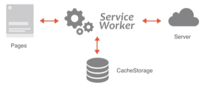
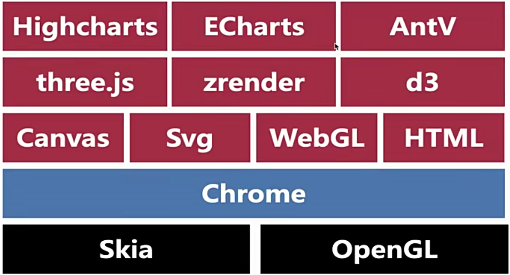

# PWA

> ​	一个标准的PWA程序，必须包含3个部分
>
> ​		https服务器或者 http://localhost
>
> ​		manifest.json
>
> ​		service worker


## 1. 什么是PWA

- 背景：

  Native APP的体验好，下载之后，进入app非常方便，但是有如下的缺点：

  - 开发成本高，对于不同的平台都需要开发对应的程序，比如Android和ios；
  - 软件的上线需要审核；
  - 版本的更新需要将新版本上传到不同的应用商店；
  - 想使用一个app就必须要先去下载使用，即使是偶尔使用一下。

- 普通网页有什么缺点

  - 桌面入口不够便捷，先要打开浏览器，还要输入地址等；
  - 没有网络就没有响应，不具备任何离线能力；
  - 不能像APP一样能进行消息推送。

- 什么是PWA

  ​	PWA全称Progressive Web App，即渐进式WEB应用。一个 PWA 应用首先是一个网页, 可以通过 Web 技术编写出一个网页应用. 随后添加上 App Manifest 和 Service Worker 来实现 PWA 的安装和离线等功能。

- PWA解决了什么问题

  - 可以添加至主桌面或屏幕，点击主屏幕图标可以实现启动动画以及隐藏地址栏；
  - 实现了离线缓存功能，即使没有网络也可以使用一些离线功能；
  - 实现了设备的消息推送。


## 2. 核心技术

​		PWA必须在 HTTPS 环境下才能工作或者http://localhost

### （1）manifest

​		menifest.json 在项目的根目录中的一个文件，可以使用它来将应用添加至桌面。

- 基本的使用步骤：
  - 在项目根目录中创建一个manifest文件；
  - 在index.html中引入manifest.json文件；
  - 在manifest.json中提供常见的配置；
  - 需要在https协议或者http://localhost下访问这个项目。

- 常见的配置：
  - name：指定应用的名称，用户安装横幅提示的名称和启动动画中的文字；
  - short_name：指定应用的短名称，用于主屏幕的显示；
  - start_url：用户从设备启动时加载的url，可以是绝对路径或者相对路径；
  - icons：指定可在各种环境中用作应用程序图表的图像对象数组，144×144；
  - background_color：用户指定启动动画的背景颜色;
  - theme_color：用于指定应用程序的主题颜色；
  - display：用于指定app的显示模式

```json
{
  "name": "豆瓣APP-PWA",
  "short_name": "豆瓣",
  "start_url": "./index.html",
  "icons": [
    {
      "src": "../images/豆瓣.png",
      "sizes": "144×144",
      "type": "image/png"
    }
  ],
  "background_color": "skyblue",
  "theme_color": "yellow",
  "display": "standalone"
}
```


### （2）Service Worker

> ​	W3C组织早在2014年5月就提出过Service Worker这样一个API，主要用来做持久的离线缓存。

- 前端有很多优化手段：CDN、CSSSprite、文件的压缩合并、异步加载、资源缓存等，但是如果断网了，这些基本没用；
- Service Worker允许web应用在网络环境中比较差或者是离线环境下一依旧可以使用；
- Service Worker可以极大地提高web app的用户体验；
- Service Worker是一个独立的worker线程，独立于当前的王爷进程，是一种特殊的Web Worker。


### （3）Service Worker基本介绍

- Web Worker是临时的，每次做完事情不能被永久保存下来，下次还有重复的操作，还会去再做一遍；
- Service Worker一旦被install，就永远存在，除非被手动unregister；
- 用到的时候可以直接唤醒，不用的时候休眠；
- 可编程拦截代理请求和返回，缓存文件，缓存的文件可以被网页进程取到（包括离线状态）；
- 离线内容开发者可控；
- 必须在HTTPS环境下工作；
- 一部实现，内部大部分是通过Promise实现的。




### （4）Service Worker的使用步骤

- 在window.onload中注册service worker，防止与其他资源竞争；

- navigator对象内置了serviceWorker属性；

- service worker在老版本的浏览器中不支持，需要进行浏览器的兼容

  ```js
  if ('serviceWorker' in navigator) {}
  ```

- 注册service worker navigator.serviceWorker.register('./sw.js')，返回一个Promise对象。

```javascript
window.onload = function() {
    if ('serviceWorker' in navigator) {
        navigator.serviceWorker
        	.register('./sw.js')
        	.then(registration => {
            	console.log(registration);
        	}).catch(err => {
         		console.log(err);   
        })	
    }
}
```


### （5）生命周期

- install事件：在service worker注册成功的时候除非，主要用于缓存资源；
- activate事件：在service worker激活的时候触发，主要用于删除旧的资源；
- fetch事件：在发送请求的时候触发，主要用于操作缓存或者读取网络资源。


### （6）cache storage

- cacheStorage接口表示Cache对象的存储，配合service worker来实现资源的缓存；
- cache api类似于数据库的操作：
  - caches.open(cacheName).then(function(catch) { })，用于打开缓存，返回一个匹配的cacheName的cache对象的Promise，类似于连接数据库；
  - cache.keys()返回一个Promise对象，包括所有的缓存的key(数据库名);
  - cache.deletKey(key)，删除对应的缓存。

- cache对象的常用方法：
  - cache接口为缓存Request / Response 对象提供了存储机制；
  - cache.put(req, res) 把请求当作key，并且把对应的响应存储起来；
  - cache.add(url) 根据url发起请求，并且把响应结果缓存起来；
  - cache.addAll(urls) 抓取一个url数组，并且把结果都存储起来；
  - cache.match(req) 获取req对应的response。


## 3. 通知 Notification

​		Notification API

​		基本使用：

- Notification API 的通知接口用于向用户配置和显示桌面通知；

- Notification.permission 可以获取当前用户的授权情况；

  - default——默认，未授权
  - denied——拒绝，无法再次请求，也无法弹窗提醒；
  - granted——授权，可以弹窗提醒。

- 通过Notification.requestPermission() 可以请求用户的授权；

- 通过new Notification('title', { body: '', icon: '' }) 可以显示通知；

- 在授权同通过的情况下，可以在 service worker 中显示通知 self.registration.showNotification('你好', { body: 'msg' })

  当网站没有连接网络的时候，可以给用户一个提示：

```javascript
if (Notification.permission === 'default') {
    Notification.requestPermission();
}
if (!navigator.onLine) {
    new Notification('提示', { body: '你当前没有网络' });
}
```


# 数据可视化



## 1. 常见数据可视化的技术选型

- canvas
- SVG
- zrender
- d3

## 2. AntV

- 统计图方案：G2
- 矢量图方案：G6
- 地图控件可视化方案：L7

## 3. Echarts

