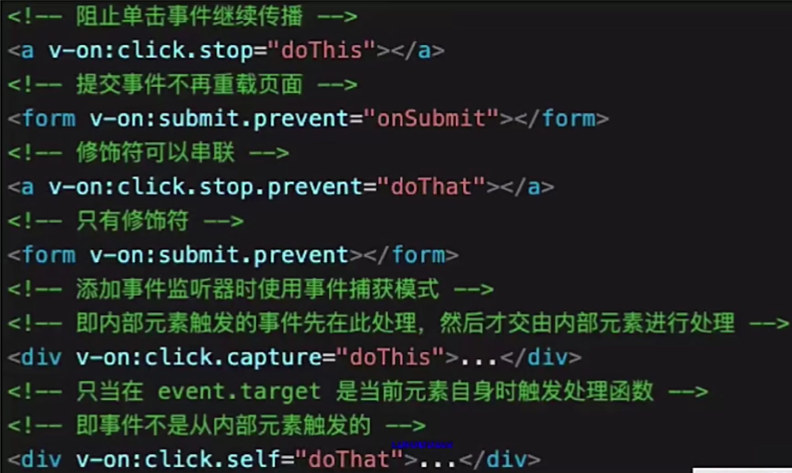

### Vue

- v-show 和 v-if 的区别

  > ​		v-show是控制组件的css的display属性，实际上是都是需要渲染组件的。而v-if是通过vue本身的机制选择组件是否创建或者销毁。当组件需要频繁切换的时候，使用v-show来控制显示，以免重复创建销毁浪费资源。

- 为什么 v-for 中要使用 key

- 描述 Vue 组件生命周期（有父子组件的情况）

- 描述Vue组件如何通信

- 描述组件渲染和更新的过程

- 双向数据绑定 v-model 的实现原理

### Webpack

- 前端代码为何要进行构建和打包
- module，chunk，bundle 分别是什么意思，有什么区别
- loader和plugin的区别

- webpack如何实现懒加载
- webpack常见的性能优化
- babel-runtime和babel-polyfill的区别


## 虚拟DOM和Diff算法

> ​		用JS对象来模拟DOM元素，使用虚拟DOM来模拟真实DOM，从而可以进行操作，使用JS进行这些操作相对速度较快。


# Vue的基本使用

## 1. 一些简单的使用

- vue-cli 创建项目。

  ```cmd
  vue create [项目名]     //命令行创建
  vue ui				   //打开图形界面
  ```

  

- mustuch语法，中间只能放值或者表达式，**不能放JS语句**。

- v-html的使用，会替换掉自己的子组件，会有XSS的风险。

  ```vue
  <p v-html="rawHtml">
      <span>我会被替换掉</span>
  </p>
  
  rawHtml = '<b>加粗</b> <i>斜体</i>';
  ```

- computed 有缓存，如果data不变，则不会重新计算。另外 computed 可以写getter、setter方法。

  ```js
  computed: {
  	someVar() {
  		get() {
  			return this.num1 + this.num2;
  		}, 
  		set(newVal) {
  			this.num1 = 2;
  			this.num2 = newVal - 2;
  		}
  	}
  }
  ```

  ​		平常写的普通的计算属性，实际上是简写，其中只有 getter。**如果将计算属性双向绑定到视图上，一定要写setter，不然会报错。**

- watch 的深度监听，对于引用类型，watch取不到 oldValue。

  ```js
  watch: {
      someVal() {
          deep: true;
          handler(newVal, oldVal) {
              console.log(newVal, oldVal); // 引用类型，拿不到oldVal，因为指针是相同的，触发这个监听函数的时候，指针已经指向了newVal
          }
      }
  }
  ```

- style 与 class 绑定，对象需要用驼峰命名

  ```vue
  <p :class="{ black: isBlack, yellow: isYellow }">使用class绑定类对象</p>
  <p :class="[black, yellow]">使用class绑定对象数组</p>
  <p :style="styleData">使用style的绑定</p>
  
  data() {
  	return: {
  		isBlack: true,
  		isYellow: false,
  		black: 'black',
  		yellow: 'yellow',
  		styleData: {
  			fontSize: '40px',	// 转化为驼峰模式
  			color: 'red'
  		}
  	}
  }
  ```

- v-show 和 v-if 的区别，什么时候使用

  ​	v-show 为false的时候，浏览器还是会渲染元素，只是把样式中的 display 设置为 none；v-if 为false的时候，浏览器根本不会渲染，在检查元素的时候也看不到。

  - 当一个组件不会频繁的切换可见状态时，使用v-if ，因为可以减小开销；
  - 当需要频繁的切换可见状态时，使用 v-show ，因为组件的创建和销毁更加浪费资源。

- v-for 遍历数组或对象

  ```html
  <p>遍历数组</p>
  <ul>
      <li v-for="(itrm, index) in listArr" :key="item.id">
          {{ index }} - {{ item.id }} - {{ item.title }}
      </li>
  </ul>
  
  <p>遍历对象</p>
  <ul>
      <li v-for="(val, key, index) in listObj" :key="key">
          {{ index }} - {{ key }} - {{ val.title }}
      </li>
  </ul>
  
  data() {
  	return {
  		listArr: [b
  			{ id: 'a', title: '标题1'}，
  			{ id: 'b', title: '标题2'}
  		],
  
  		listObj: {
  			a: { title: '标题1' },
  			b: { title: '标题2' }
  		}
  	}
  }
  ```

- v-for 和 v-if 同时使用

  > ​		v-for 的优先级要高于 v-if 。这意味着 `v-if` 将分别重复运行于每个 `v-for` 循环中。所以，不推荐v-if和v-for同时使用
```vue
  <li v-for="todo in todos" v-if="!todo.isComplete">
  	{{ todo }}
  </li>
```

- 推荐使用方式
``` vue
  <ul v-if="shouldShowUsers">
  	<li v-for="user in activeUsers" :key="user.id">
  		{{ user.name }}
  	</li>
  </ul>
  
  <!--或者在计算属性中得到结果-->
  <ul>
  	<li v-for="user in activeUsers" :key="user.id" >
  		{{ user.name }}
  	</li>
  </ul>
  
  computed: {
  	activeUsers: function () {
  		return this.users.filter(function (user) {
  			return user.isActive
  		})
  	}
  }
```

- event 事件

  ```vue
  <button @click="func">按钮</button>
  <button @click="func($event)">按钮</button>
  
  methods: {
  	func(event) {
  		console.log(event);	  // 原生的event对象
  		console.log(event.target);
  		console.log(event.currentTarget);
  	}
  }
  ```

  - 事件是原生的
  - 事件被挂载到当前的元素

- 事件修饰符

  

  


## 2. Vue组件

### （1） 自定义事件——两个不相关的组件之间的传值

```js
// event.js
import Vue from 'vue';
export default new Vue();
```

```vue
<!--在需要传值的组件中绑定一个自定义的事件-->
import event from './event';	// 这是任意一个Vue组件作为中间组件

mounted() {
	// 绑定事件
	event.$on('eventName', this.handler);	
},
beforeDestroy() {
	// 解绑事件，如果不解绑会造成内存泄漏
	event.$off('eventName', this.handler);
}

methods: {
	handler(someData) {}
}
```

```vue
<!--在另外一个组件中-->
import event from './event';	// 中间组件

methods: {
	someFunc() {
		event.$emit('eventName', someData);
	}
}
```

### （2） 组件生命周期

- 单个组件的情况

  - 创建阶段

    > created钩子函数，data、methods已经被初始化了，但是Vue实例还没有编译模板，因此只能操作数据或者方法，并不能操作DOM元素。
    >
    > mouted钩子函数，模板字符串已经被挂载到页面上，可以操作DOM元素了。

  - 运行阶段 

  - 销毁阶段


- 父子组件的生命周期

  - 创建阶段：父组件beforeCreated ->父组件created ->父组件beforeMounted ->子组件beforeCreated ->子组件created ->子组件beforeMounted ->子组件mounted -> 父组件mounted。

    

  - 子组件销毁阶段：

    父组件beforeUpdate -->子组件beforeDestroy--> 子组件destroyed --> 父组件updated

    > 对于父组件来说，子组件的destroy只需要更新自己的视图，所以是update。


## 3. Vue高级特性

> ​		不是每个都很常用，但是用到的时候必须知道。

### （1） 自定义v-model

> ​		v-model本身只给 input 事件实现了，如果想要给自己的组件实现v-model，则必须要自定义。

- 首先可以用双向的数据传递来实现，父组件给子组件传值，子组件如果修改了值就触发事件，父组件根据事件又修改自己的值。

  - 父组件

  ```vue
  <template>
    <div>
      <test-model :value="value" @input="handleInputValue"></test-model>
      <div :style="{background: value,height: '400px'}"></div>
    </div>
  </template>
  <script>
      export default {
          data(){
              return {
                   value: '#000000'
              }
          },
          methods: {
              handleInputValue(val) {
                  this.value = val
              }
          }
      }
  </script>
  ```

  - 子组件

  ```vue
  <template>
    <input :value="value" @input="handleInput($event)" type="text">
  </template>
  
  <script>
    export default {
      props: ['value'],
      data() {
        return {}
      },
      methods: {
        handleInput(e) {
          this.$emit('input', e.target.value)
        }
      }
    }
  </script>
  ```

- **使用 v-model 语法糖**

  > ​		v-model还可以在自定义组件中使用，可以被拆解为props: value和event：input，也就是说组件必须接收一个value值以及名为input的自定义事件，就可以在自定义组件上使用v-model了。

  - 父组件：直接使用v-model，并不需要指定事件。

  ```vue
  <template>
    <div>
      <test-model v-model='value'></test-model>
      <div :style="{background: value,height: '400px'}"></div>
    </div>
  </template>
  <script>
      export default {
          data(){
              return {
                   value: '#000000'
              }
          }
      }
  </script>
  ```

  - 子组件使用 model 的 option

  ```vue
  <template>
    <input @input="handleInput($event)" type="text">
  </template>
  
  <script>
    export default {
      props: ['value'],
      
      model: {
          prop: 'value',
          event: 'handleInput'
      }
        
      methods: {
        handleInput(e) {
          this.$emit('handleInput', e.target.value)
        }
      }
    }
  </script>
  ```

  

### （2） $nextTick

> ​		Vue是一个异步渲染的框架，但是 data 改变后，DOM不会立刻渲染。$nextTick 会在DOM渲染之后被触发，以获取最新的DOM节点。
>
> ​		Vue页面渲染时，会将 data 做整合，即一段时间内多次 data 的修改，只会引起一次重新渲染。

```js
this.$nextTick(() => {
    do something;
})
```


### （3） slot

- 基本使用：让父组件向子组件插入一段内容，插槽显不显示、怎样显示是由父组件来控制的，而插槽在哪里显示就由子组件来进行控制。

  ```vue
  <!--子组件navigationLink中-->
  <template>
  	<a v-bind:href="url" class="nav-link">
    		<slot>这是后备内容，如果父组件不使用插槽，这里就会被显示，否则这里被替换</slot>
  	</a>
  </template>
  
  <!--父组件中使用子组件-->
  <navigation-link url="/profile">
        Your Profile
  </navigation-link>
  ```

  ​		当组件渲染的时候，`<slot></slot>` 将会被替换为“Your Profile”。插槽内可以包含任何模板代码，包括 HTML和其他组件。如果 `<navigation-link>` 的 `template` 中**没有**包含一个 `<slot>` 元素，则该组件起始标签和结束标签之间的任何内容都会被抛弃。

- 具名插槽：需要多个插槽的时候，根据名字将元素插入到对应的插槽里，一个不带 `name` 的 `<slot>` 出口会带有隐含的名字“default”。

  ```vue
  <!--子组件-->
  <div class="container">
    <header>
      <slot name="header">这里是页头</slot>
    </header>
    <main>
      <slot>主体</slot>
    </main>
    <footer>
      <slot name="footer">这里是页脚</slot>
    </footer>
  </div>
  
  <!--父组件-->
  <child>
  	<template v-slot:header></template>
      <template v-slot:default></template>
      <template v-slot:footer></template>
  </child>
  ```

  ​		现在 `<template>` 元素中的所有内容都将会被传入相应的插槽。任何没有被包裹在带有 `v-slot` 的 `<template>` 中的内容都会被视为默认插槽的内容。注意 **`v-slot` 只能添加在 `<template>` 上** (只有[一种例外情况](https://cn.vuejs.org/v2/guide/components-slots.html#独占默认插槽的缩写语法)，那就是匿名的独占插槽)，这一点和已经废弃的 [`slot` attribute](https://cn.vuejs.org/v2/guide/components-slots.html#废弃了的语法) 不同。

  ​	**这是v-slot的新写法：**

  

- 作用域插槽

  - 编译作用域：

    ​		父级模板里的所有内容都是在父级作用域中编译的；子模板里的所有内容都是在子作用域中编译的。因此，在不做任何操作的情况下，**父子组件都只能访问到自己作用域内的数据**。

  - **作用于插槽的作用**：让父组件能够获取到子组件的数据。

  ```vue
  <!--子组件-->
  <span>
    <slot v-bind:user="user">	 <!--user是子组件中的变量-->
      {{ user.lastName }}
    </slot>
  </span>
  
  <!--父组件-->
  <current-user>
    <template v-slot:default="slotProps">	 <!--slotProps名字可以自定义，这里还能写成解构赋值的形式-->
      {{ slotProps.user.firstName }}	<!--获取到了子组件传来的值-->
    </template>
  </current-user>
  ```

  

### （4） 动态、异步组件

- **动态组件**：需要根据数据，动态地渲染场景，即组件类型不确定，这时候就需要用到动态组件。

  **:is="component-name"**用法

  ```vue
  <template>
  	<!--动态组件-->
  	<component :is="comName"></component>
  </template>
  <script>
  	...
      components: {
          Com1, Com2, Com3
      }, 
      data() {
          return {
              comName: 'Com1',
          }
      }
  </script>
  ```

- **异步组件**：当组件比较大时，如果同步加载可能造成加载缓慢，这时考虑异步加载组件。使用**import**函数。

  ```vue
  <template>
  	<Com v-if='flag'></Com>	  <!--当flag为false的时候才加载Com组件-->
  </template>
  <script>
  	components: {
          Com: () => import('../Components/Com')
      }
  </script>
  ```

  

### （5） keep-alive

- 缓存组件：当需要频繁切换页面，而组件又太大，或者不想让组件频繁的创建销毁，则可以用keep-alive。

  ```vue
  <!--Com1和Com2都只创建一次，直到父组件销时才销毁-->
  <keep-alive>
      <Com1 v-if='flag'></Com1>
      <Com2 v-if='!flag'></Com2>
  </keep-alive>
  ```


- 属性：
  - include：白名单，表示在这些名单里的组件，是需要缓存的；
  - exclude：黑名单，表示在这些名单里的组件不会被缓存；
  - max：表示缓存的最大的组件的数量，超过数量就会采用LRU算法置换。

- 生命周期：

  ​	加入keep-alive之后，在被缓存的组件中会多两个生命周期，那就是**activated**和**deactivated**。


###  （6） mixin

> ​		mixins 是组件的一个option，和data()、methods 在同一个层级。用于混合其他的对象。
>
> ​		当多个组件拥有相同的数据或者代码逻辑的时候，可以考虑使用mixin。

- 用法：

  - mixin.js ：用于混合的一个对象

  ```js
  export default {
      data() {
          return {
              
          }
      }, 
      methods: {
          show() {}
      }
  }
  ```

  - 组件Com：

  ```vue
  <script>
      import mix from './mixin';
      export default {
          mixins: [ mix ],
          data() {
              return {}
          }
      }
  </script>
  ```

  **注意**：如果有多个组件同时引入了同一个混合对象，他们是不共享的，更改其中一个组件中值不影响另外一个组件。

- mixin的缺点：
  - 变量来源不明确，不利于阅读；
  - 引入多个 mixin 的时候，可能造成命名冲突；
  - mixin 和组件之间可能会出现多对多的关系，复杂度表较高。


### （7） directive自定义指令

- 全局的自定义指令：

  ```js
  // 注册一个全局自定义指令 `v-focus`
  Vue.directive('focus', {
    // 当被绑定的元素插入到 DOM 中时……
    inserted: function (el) {
      // 聚焦元素
      el.focus()
    }
  })
  ```

- 组件内的局部自定义指令：

  ```js
  directives: {
    focus: {
      // 指令的定义
      inserted: function (el) {
        el.focus()
      }
    }
  }
  ```

- 使用：

  ```vue
  <input v-focus></input>
  ```

- 钩子函数：

  - bind：只调用一次，指令第一次绑定到元素时调用；
  - inserted：被绑定的那个dom元素被插入到父节点中的时调用；
  - update：所在组件的VNode更新的时候调用；
  - componentUpdated：指令所在的组件的VNode及其子VNode全部更新完成后调用；
  - unbind：只调用一次，指令与元素解绑的时候调用。


## 4. Vuex


> ​	用全局单例模式管理组件之间的共享状态。在这种模式下，我们的组件树构成了一个巨大的“视图”，不管在树的哪个位置，任何组件都能获取状态或者触发行为。Vuex采用MVC模式中的Model层，规定所有的数据必须通过action--->mutaion--->state这个流程进行来改变状态的。再结合Vue的数据视图双向绑定实现页面的更新。统一页面状态管理，可以让复杂的组件交互变的简单清晰，同时在调试时也可以通过DEVtools去查看状态。

- 用state管理状态，mutations更改状态，**mutations必须同步执行**。

- getters作为state的计算属性，和组件中的computed作用一样。

  ```vue
  const store = new Vuex.Store({
  	state: {
  		msg: ''
  	},
  	getters: {
  		formatMsg(state) {
  			return state.msg + '123';
  		}
  	}
  })
  
  // 组件中的使用
  this.$store.getters.formatMsg
  ```

- **Action**：类似于mutation，但它不直接操作state，而是通过提交mutation修改state。而且接受的参数不是state，而是和store实例具有相同方法和属性的contex对象。**Action内应该执行异步操作**。

  ```js
  actions: {
      anAction(context) {
          setTimeout(() => {
              context.commit('increment');
          }, 1000);
      }
  }
  
  	// 可以用对象解构赋值
  	anAction({ commit }) {
          setTimeout(() => {
              commit('increment');
          }, 1000);
      }
  ```


## 5. Vue-router

### （1） 路由模式

- hash模式（默认模式），比如http://abc.com/#user/10

- history模式，比如http://abc.com/user/20

  ```js
  const router = new VueRouter({
      mode: 'history',
      routes: [......]
  })
  ```

- 后者需要server的支持，如果没有特殊要求可以选择前者。

### （2） 动态路由

```js
const router = new VueRouter({
    routes: [
        // 动态路径参数，以冒号开头。能命中'/user/10' '/user/20'等格式的路由
        { path: '/user/:id', component: User }
    ]
})
```

### （3） 路由懒加载

​		加载组件的时候是异步的，当我们访问到该路径的时候，才动态地加载组件。

```js
routes: [
    {
        path: '/',
        component: () => import('../components/someComponent')
    }
]
```


# Vue 底层原理

## 1. Vue MVVM

> - 很久以前（Web 1.0），就已经出现了组件化，比如asp, jsp, php等，node.js中也有类似的组件化。传统组件的组件化，只是静态渲染，需要在后台将元素、数据渲染完成后发送给前端，更新还需要依赖于操作DOM。
> - 后来出现了数据驱动视图的概念。Vue — MVVM， React — setState。
> - 什么是数据驱动试图：不再去自己操作DOM，只需要操作数据，关注业务逻辑，框架本身根据数据重新渲染视图。


- MVVM核心：Model—View—ViewModel，中间层监听DOM操作来修改Model数据，也将Model层的数据绑定到DOM上实现控制渲染。


## 2. Vue的响应式

> - 组件data的数据一旦变化，立刻触发视图的更新
> - 它是实现数据驱动视图的第一步

### （1） 核心API：Object.defineProperty

- 基本使用

  ```js
  const data = {};
  const name = 'zhangsan';
  Object.defineProperty(data, 'name', {
      get: function() {
          return name;
      },
      set: function(newVal) {
          name = newVal;
      }
  })
  ```

  > ​		当你把一个普通的 JavaScript 对象传入 Vue 实例作为 `data` 选项，Vue 将遍历此对象所有的 property，并使用 [`Object.defineProperty`](https://developer.mozilla.org/zh-CN/docs/Web/JavaScript/Reference/Global_Objects/Object/defineProperty) 把这些 property 全部转为 [getter/setter](https://developer.mozilla.org/zh-CN/docs/Web/JavaScript/Guide/Working_with_Objects#定义_getters_与_setters)。`Object.defineProperty` 是 ES5 中一个无法 shim 的特性，这也就是 Vue 不支持 IE8 以及更低版本浏览器的原因。

### （2） 监听复杂对象，深度监听

```js
function defineReactive(target, key, value) {
    // 深度监听，递归
    observer(value);
    
    Object.defineProperty(target, key, {
        get() {
            return value;
        },
        set(newVal) {
            if (newVal !== value) {
                // 新设置的值也要进行监听
                observer(newVal);
                
                value = newVal;
                // 触发更新视图
                updateView()；
            }
        }
    })
}

// 监听对象属性
function observer(target) {
    if (typeof target !== 'object' || target === null)
        return target;
    // 重新定义各个属性
    for (let key in target) {
        defineReactive(target, key, target[key]);
    }
}
```

### （3） 监听数组的变化

```js
// 重新定义数组原型
const oldArrayProperty = Array.prototype;
// 创建新对象，这个新对象的原型指向oldArrayProtperty，再扩展新的方法不会影响到Array.prototype
const arrProto = Object.create(oldArrayProperty);
// 加入常用的方法
['push', 'pop', 'shift', 'unshift', 'splice'].forEach(methodName => {
    arrProto[methodName] = function() {
        updateView();		// 触发视图更新	
        oldArrayProperty[methodName].call(this, ...arguments);
        // 即Array.prototype[methodName].call(this., ...arguments)
    }
})

// 修改之前的observe函数，加入对数组的支持
function observer(target) {
    if (typeof target !== 'object' || target === null) {
        // 不是对象或者数组
        return targrt;
    }
    if (Array.isArray(target)) {
        target.__proto__ = arrProto;
    }
    for (let key in target) {
        defineReactive(target, key, target[key]);
    }
}
```

### （4） defineProperty的缺点

- 深度监听的时候，需要递归到底，一次性监听的时候计算量较大；
- 无法监听新增和删除的属性：即直接设置**data.x = 123，delete  data.name**这样的操作，对于已经进行监听的data来说是无效的。在使用的时候，必须使用**Vue.set 和 Vue.delete**方法；
- defineProperty无法监听数组，需要特殊处理。


## 3. 虚拟DOM和Diff算法

> - VDOM是实现Vue和React的重要基石；
> - Diff算法是VDOM中最核心、最关键的部分；

- DOM操作是非常耗时的，JS相对来说非常高效；
- 以前使用JQuery，可以自行控制DOM的操作实际，手动调整，但是当时功能有限，复杂度较低；
- Vue和React是数据驱动视图，而且现在有一些较为复杂的页面，具有一定的复杂度。想要减少计算的次数比较困难；
- 虚拟DOM的出现就是将DOM的计算，转化为JS计算，因为JS执行速度很快。用JS模拟DOM结构，计算出最小的变更之后，再去操作DOM。


### （1） 通过snabbdom学习VDOM

> ​		它是一个简洁强大的VDOM库，易学易用。Vue参考了它实现的VDOM和Diff算法。Vue 3.0中重写了VDOM代码，优化了性能；React VDOM和Vue VDOM的具体实现也不同，但是基本理念不变。

[https://github.com/snabbdom/snabbdom](https://github.com/snabbdom/snabbdom)

​		每个VDOM节点最基本的三个元素： tag，attrs/props，children

``` json
{
	tag:'ul',
	attrs:{
 		id:'list'
	},
	children:[{
    	tag:'li',
    	attrs:{
      		className:'item',
  		},
  		children:['Item1']
	}]
}
```


### （2） diff算法

> ​		它是VDOM中最核心、最关键的部分；diff算法能在日常的Vue和React的使用中体现出来（比如 key）。
>
> ​		diff即对比，是一个比较广泛的概念，比如linux diff命令、git diff等；两个JS对象也可以做Diff。

- 算法概述：

  ​	  普通的树diff的算法复杂度是O(n^3)，这个时间复杂度是不可用的：a、遍历第一棵树；b、遍历第二棵树；c、排序。因此这里的DIff算法要进行优化，优化到时间复杂度为**O(n)**：

  - 只比较同一层级，不跨级比较；
  - tag 不相同，直接删掉重建，不再深度比较；
  - tag 和 key，两者如果都相同，则认为是相同的节点，不再深度比较。


- 源码核心函数解读

  >  来自snabbdom的源码

   	**几个关键的函数**

  - 生成 vnode

    ​		h函数的调用会返回一个 vnode 函数的调用，vnode 函数调用以后返回一个对象。上面一个图是 h 函数的返回；下面一张图是 vnode 函数的返回。

    

    

  - sameVnode函数

    ``` typescript
    function sameVnode(vnode1, vnode2) {
        return vnode1.key === vnode2.key && vnode1.sel === vnode2.sel;
    }
    ```

    ​	  在 vnode 的children中，每个vnode有一个标记值，标记着在新vnode中还有哪些旧的vnode存在，key值就是充当着这个角色。

  - patch

    ​		这个函数是用来进行对比渲染的。调用snabbdom的init函数会返回patch函数。其中如果发现新的vnode和旧的vnode相等，则调用**patchVnode**函数。否则删掉旧的vnode，重建新的vnode。

    

  - patchVnode

    ​		先判断新旧vnode有没有children，一共分四种情况。前三种情况都可以当场处理，第四种情况，即两个节点都有children则调用 **updateChildren** 函数，比较新旧节点的children。

  - updateChildren

    ​		新旧节点的children列表分别用一头一尾两个指针遍历比较。然后还利用 key 找在旧节点children中是否存在，如果存在就直接替换到新位置。否则创建元素插入。


## 4. 模板编译

> - 模板时Vue开发中最常用的部分；
> - 模板不是html，有指令、插值、JS表达式，到底是什么；
> - 组件选和更新过程与模板编译关系密切。

**Vue的渲染过程**


### （1） 模板编译是什么

- 模板不是html，它有指令、插值、JS表达式、能实现判断、循环；
- html是标签语言，只有JS才能实现判断、循环（图灵完备的）；
- 因此，模板一定是转换成为某种JS代码，即模板编译。


​		**Vue的模板转化为JS代码，即得到一个render函数，render函数调用之后返回vnode，vnode会被渲染（基于vnode再执行patch和diff）。**

```js
const compiler = require('vue-template-compiler');
const template = '<p>我是哈默</p>';
const result = compiler.compile(template);
console.log(result);
```


### （2） render函数——返回vnode

​		简单的说，在vue中我们使用模板HTML语法来组建页面的，使用render函数我们可以用js语言来构建DOM。因为vue是虚拟DOM，所以在拿到template模板时也要转译成VNode的函数，而用render函数构建DOM，vue就免去了转译的过程。

​		当使用render函数描述虚拟DOM时，vue提供一个函数，这个函数是就构建虚拟DOM所需要的工具。官网上给他起了个名字叫createElement。还有约定它的简写叫h。**这个createElement函数作为第一个参数传进render**。createElement第一个参数表示节点类型，createElement的第二个参数选填，表示属性的对象，常用的有**class | style | attrs | domProps | on**，createElement第三个参数选填，表示自己子虚拟节点。

​		**render函数的返回值是一个createElementde的调用返回，即 vnode**，即虚拟节点，就是我们要渲染的节点。

```js
render(createElement) {
      let self = this
      return createElement('input', {
        domProps: {
          value: self.name
        },
        on: {
          input(event) {
            self.$emit('input', event.target.value)
          }
        }
      })
}

```


### （3） 使用webpack的 vue-loader

​		在开发时就编译好代码，而不是在运行时编译。


### （4） 模板编译的过程

- 获取到 template；
- 把 template 转化为 AST 树；
- 把 AST 转化为 render 函数，即先拼接成包含 _c   _v   _s 的字符串，再把这个字符串变成函数；
- render函数执行生成虚拟节点 VDOM；
- 设置补丁 PATCH， 并把补丁打到真实 DOM 中。


## 5. 组件渲染、更新的过程

### （1） 初次渲染过程

- 解析模板为render函数（或在开发环境下已经完成，vue-loader）；
- 触发响应式，监听data属性的getter和setter；
- 执行render函数，生成vnode，然后patch(elem, vnode)，elem就是组件对应的那个dom节点。

### （2） 更新过程

- 修改data，触发了data的setter函数（已经被监听了）；
- 重新执行render函数，生成一个newVnode；
- patch(vnode, newVnode)。

### （3） 流程图


### （4） 异步渲染

- $nextTick的用法；


- 汇总了data的修改，并一次性更改视图；
- 减少了DOM的操作次数，提高性能。


##  6. 前端路由原理

> - 稍微复杂一点的SPA（single page application），都需要路由；
> - vue-router也是vue全家桶的标配之一；

### （1） Hash


- hash变化会触发网页跳转，即浏览器的前进、后退；
- hash变化不会刷新页面，这是SPA必须的特点；
- hash永远不会提交到server端（完全由前端控制）；
- **window.onhashchange**监听hash路由的变化。

```js
// 全局有一个hashChange事件可以监听hash的变化，从而实现路由跳转
window.onhashchange = event => {
    console.log(event.newURL);
    console.log(event.oldURL);
    console.log(location.hash);
}

// 可以手动修改hash，不会导致页面刷新，如果修改了其他部分可能会导致页面刷新
location.hash= = '#/user';
```


### （2） H5 History

> 一个规范的路由，没有#，用户看不出是前端路由还是后端路由。

- 用url规范的路由，但跳转时不刷新页面，这是SPA必须的；
- 使用**history.pushState和replaceState **修改地址；
- 使用**window.onpopstate**监听路由变化。
- 需要后端配合，刷新页面时，浏览器会根据当前url去请求服务器，通常是找不到的。因此后端需要判断这个url并且返回index.html。再由前端通过pushState来更换路由。


```js
// 切换路由
const state = { name: '第一页' };
history.pushState(state, '标题', 'page1');

// 监听路由的变化
window.onpopstate = event => {
    console.log(event.state);
    console.log(location.pathname);
}
```


### （3） 总结

- 用法
  - hash —— window.onhashChange；
  - H5 history —— history.pushState，history.replaceState 和 window.onpopstate；
  - H5 history 需要后端支持。

- 如何选择：
  - to B 的系统（后台管理系统），推荐hash，简单易用，对url不敏感；
  - to C 的系统可以考虑使用history，但需要服务器支持；
  - 能简单就简单。


# Vue 3

## 1. 升级的内容

- 全部使用 ts 重写 （响应式、vdom、模板编译等等）；
- 性能提升，代码量减少；
- 会调整部分 API


## 2. Proxy实现响应式

### （1） 基本使用


 


# Webpack

> ​		webpack已经是前端打包构建的不二选择，它是一个成熟的工具，重点在于配置和使用，而不是原理。

## 1. 概念

### （1） 前端为什么要打包

- 根据依赖将多个资源文件打包成一个或少数个，可以减少http请求下载资源。而且可以理清楚资源的依赖关系。

- 打包同时会进行编译，将ES6、Sass等高级语法进行转换编译，以兼容高版本的浏览器（babel）。
- 代码可以在打包构建过程中压缩，加载更快。
- 可以提高兼容性和错误检查（polyfill，eslint）。
- 统一、高效的开发环境，统一的构建流程和产出标准。
- 集成公司构建规范。

​		

## 2. babel-polyfill

### （1） 什么是polyfill

​		polyfill是补丁，在之前的版本的js中，加入某一个对象，没有某个方法，polyfill会对原来的js对象原型打补丁。补丁可以按需引入。

### （2） core.js

​		是一个标准库，集成了ES6，ES7等新语法的polyfill补丁，使用时可以全部引入。但是它不支持ES6 中的 generater 函数。

### （3） babel-polyfill

​		上面两者的集合。在Babel 7.4之后弃用。推荐直接使用core.js 和 generate的polyfill。


## 3. module、chunk、bundle

- module：各个源码文件，在webpack中，一切皆为module；
- chunk： 多个模块通过引用关系合并而成的；
- bundle：webpack在处理好chunk文件后，最终输出的文件。


​		**一句话总结**

`			module`，`chunk` 和 `bundle` 其实就是同一份逻辑代码在不同转换场景下的取了三个名字：我们直接写出来的是 module，webpack 处理时是 chunk，最后生成浏览器可以直接运行的 bundle。


## 4. loader和plugin

### （1） 区别

- loader：模块转换器，比如less转换为css
- plugin：扩展插件，拓展webpack的功能，比如在转换完成后需要的一些功能。

### （2） 常见的loader

- babel-loader：把 ES6+ 代码转换成 ES5
- css-loader：加载css，支持模块化、压缩、文件导入等特性
- style-loader：把css注入到JS代码中，通过DOM操作加载css
- file-loader：帮助webpack加载一些图片文件并给他们生成hash名字
- vue-loader：加载转义vue组件

### （3） 常见的plugin

- HtmlWebpackPlugin：根据模板生成html文件
- uglifyjs-webpack-plugin：js代码的丑化压缩
- mini-css-extract-plugin：将css单独抽离成文件，而不是插入js代码中


## 5. 懒加载

​		**import() 函数**

```js
// 引入动态数据——懒加载
setTimeout(() => {
    import('./dynamic-data.js').then(res => {
        console.log(res);
    })
}, 1500);
```

