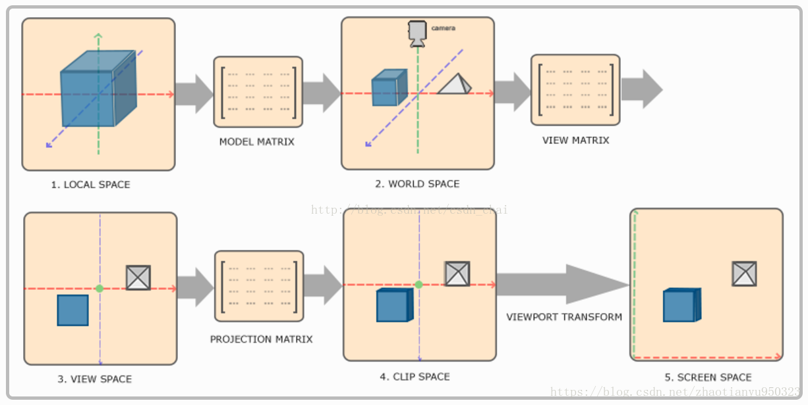

#  计算机图形学

## 1. 坐标系和空间，空间的转换

- 物体坐标系（本地坐标系）：`Local Space`或`Model Space`；
- 世界坐标系 `World Space`

- 观察者坐标系（摄像机坐标系） *View Space*

- 裁剪空间 *Clipping Space*

- 屏幕空间 *Screen Space*

​       其中前四个矩阵之间，主要通过***model， view， projection***矩阵进行相关的变换， 裁剪空间到屏幕空间通过**视口变换**进行；前三个是三维空间，后面两个是二维空间。

​		所有的变换都发生在**顶点着色器**，经过**顶点着色器**，所有的顶点都变成了屏幕上的二维坐标，下一步是进行**图元装配**之后进入**几何着色器**。

## 2. 变换矩阵的作用

​		在顶点着色器中的三个矩阵变换：**模型矩阵、观察矩阵、投影矩阵**。

- **Model matrix 模型矩阵**。进行物体坐标系到世界坐标系的转换。控制了物体的平移、旋转、缩放。在3D建模软件中为模型坐标，导入游戏后使用model matrix进行大小、位置、角度的相关设置。
- **View matrix 观察矩阵**。将世界坐标系变换到观察者坐标系，通过一些平移、旋转的组合来移动整个场景（而不是去移动摄像机，摄像机是一个虚拟的概念，事实上代码中并没有摄像机camera， 而是用view matrix来表示摄像机，然后把view matrix附加到每一个物体，来模拟相关的摄像机操作），用来模拟一个摄像机。
- **projection matrix 投影矩阵**。将观察者坐标系转换到裁剪坐标系。将3D坐标投影到2D屏幕上，裁剪空间外的顶点会被裁掉，投影矩阵指定了坐标的范围。

> **视口变换**是什么？ 	视口变换发生在投影到2D屏幕后，将投影之后归一化的点映射到屏幕上指定的一块区域。

## 3. 渲染管线

​		渲染管线也称为渲染流水线，是显示芯片内部处理图形信号相互独立的的并行处理单元。一个流水线是一序列可以并行和按照固定顺序进行的阶段。每个阶段都从它的前一阶段接收输入，然后把输出发给随后的阶段。就像一个在同一时间内，不同阶段不同的汽车一起制造的装配线，传统的图形硬件流水线以流水的方式处理大量的顶点、几何图元和片段。

​		渲染管线的流程是在GPU中进行的，它主要占用计算机的显存部分。渲染管线在这个过程进行了顶点处理、面处理、光栅化、像素处理。

- 渲染管线的几大阶段：
  - **应用程序阶段**：主要是`CPU`和内存在打交道，例如碰撞检测、计算好的数据（顶点坐标、法向量、纹理坐标、纹理等）就会通过数据总线传给图形硬件；
  - **几何阶段**：负责顶点坐标变换、光照、裁剪、投影以及屏幕映射，在该阶段的末端得到经过变换和投影之后的顶点坐标、颜色以及纹理坐标。简言之，几何阶段的主要工作就是变化**三维顶点坐标**和**光照计算**；
  - **光栅阶段**：
    - 图元装配，图元一般分为点、线、三角形；
    - 光栅化和插值，把图元分为小的像素格子，并且正确地配色；
    - 像素操作：模板测试、深度测试、混合、写入帧缓存。

​		**一张更形象的图**

## 4. 着色器

- 顶点着色器 `Vertex Shader`：计算顶点的位置，并将顶点投影在二维平面上；
- 几何着色器 `Geometry Shader`：将形状（图元）划分为更多的形状（图元），影响后面的插值结果，例如可以将一个复杂的图形，转换为多个三角面片的组合图形，然后进行一个几何着色器的分片过程；
- 片元着色器（片段着色器）`Fragment Shader`：根据顶点着色器和集合着色器输出插值，计算出每一个片元的颜色。之后会送入测试和混合之后生成最终的像素。

## 5. 光栅化

​		光栅化（栅格化或者像素化）负责的是整个渲染过程中的几何成像环节，吧几何图元（点、先、面）投影到成像平面并确定哪些像素或采样点被图元覆盖。

输入：一个三角形的三个顶点（片元的三个顶点），输出：这个三角形会覆盖屏幕上的哪些像素，可以认为是像素列表。

